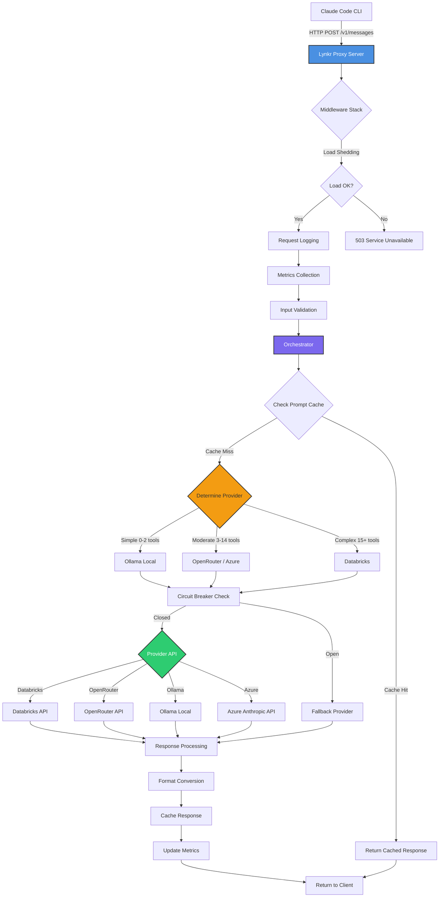

# Lynkr -  Claude Code Proxy with Multi-Provider Support, MCP Integration & Token Optimization

[](https://www.npmjs.com/package/lynkr "Lynkr NPM Package - Claude Code Proxy Server")
[](https://github.com/vishalveerareddy123/homebrew-lynkr "Install Lynkr via Homebrew")
[](LICENSE "Apache 2.0 License - Open Source Claude Code Alternative")
[](https://deepwiki.com/vishalveerareddy123/Lynkr "Lynkr Documentation on DeepWiki")
[](https://www.databricks.com/ "Databricks Claude Integration")
[](https://aws.amazon.com/bedrock/ "AWS Bedrock - 100+ Models")
[](https://openai.com/ "OpenAI GPT Integration")
[](https://ollama.ai/ "Local Ollama Model Support")
[](https://github.com/ggerganov/llama.cpp "llama.cpp GGUF Model Support")
[](https://www.indexnow.org/ "SEO Optimized with IndexNow")
[](https://devhunt.org/tool/lynkr "Lynkr on DevHunt")

> ** Claude Code proxy server supporting Databricks, AWS Bedrock (100+ models), OpenRouter, Ollama & Azure. Features MCP integration, prompt caching & 60-80% token optimization savings.**

## 🔖 Keywords

`claude-code` `claude-proxy` `anthropic-api` `databricks-llm` `aws-bedrock` `bedrock-models` `deepseek-r1` `qwen3-coder` `openrouter-integration` `ollama-local` `llama-cpp` `azure-openai` `azure-anthropic` `mcp-server` `prompt-caching` `token-optimization` `ai-coding-assistant` `llm-proxy` `self-hosted-ai` `git-automation` `code-generation` `developer-tools` `ci-cd-automation` `llm-gateway` `cost-reduction` `multi-provider-llm`

---

## Table of Contents

1. [Why Lynkr?](#why-lynkr)
2. [Quick Start (3 minutes)](#quick-start-3-minutes)
3. [Overview](#overview)
4. [Supported AI Model Providers](#supported-ai-model-providers-databricks-openrouter-ollama-azure-llamacpp)
5. [Lynkr vs Native Claude Code](#lynkr-vs-native-claude-code)
6. [Core Capabilities](#core-capabilities)
   - [Repo Intelligence & Navigation](#repo-intelligence--navigation)
   - [Git Workflow Enhancements](#git-workflow-enhancements)
   - [Diff & Change Management](#diff--change-management)
   - [Execution & Tooling](#execution--tooling)
   - [Workflow & Collaboration](#workflow--collaboration)
   - [UX, Monitoring, and Logs](#ux-monitoring-and-logs)
7. [Production-Ready Features for Enterprise Deployment](#production-ready-features-for-enterprise-deployment)
   - [Reliability & Resilience](#reliability--resilience)
   - [Observability & Monitoring](#observability--monitoring)
   - [Security & Governance](#security--governance)
8. [Architecture](#architecture)
9. [Getting Started: Installation & Setup Guide](#getting-started-installation--setup-guide)
10. [Configuration Reference](#configuration-reference)
11. [Runtime Operations](#runtime-operations)
   - [Launching the Proxy](#launching-the-proxy)
   - [Connecting Claude Code CLI](#connecting-claude-code-cli)
   - [Using Ollama Models](#using-ollama-models)
   - [Hybrid Routing with Automatic Fallback](#hybrid-routing-with-automatic-fallback)
   - [Using Built-in Workspace Tools](#using-built-in-workspace-tools)
   - [Working with Prompt Caching](#working-with-prompt-caching)
   - [Integrating MCP Servers](#integrating-mcp-servers)
   - [Health Checks & Monitoring](#health-checks--monitoring)
   - [Metrics & Observability](#metrics--observability)
12. [Manual Test Matrix](#manual-test-matrix)
13. [Troubleshooting](#troubleshooting)
14. [Roadmap & Known Gaps](#roadmap--known-gaps)
15. [Frequently Asked Questions (FAQ)](#frequently-asked-questions-faq)
16. [References & Further Reading](#references--further-reading)
17. [Community & Adoption](#community--adoption)
18. [License](#license)

---

## Why Lynkr?

### The Problem
Claude Code CLI is locked to Anthropic's API, limiting your choice of LLM providers, increasing costs, and preventing local/offline usage.

### The Solution
Lynkr is a **production-ready proxy server** that unlocks Claude Code CLI's full potential:

- ✅ **Any LLM Provider** - [Databricks, AWS Bedrock (100+ models), OpenRouter (100+ models), Ollama (local), Azure, OpenAI, llama.cpp](#supported-ai-model-providers-databricks-aws-bedrock-openrouter-ollama-azure-llamacpp)
- ✅ **60-80% Cost Reduction** - Built-in [token optimization](#token-optimization-implementation) (5 optimization phases implemented)
- ✅ **Zero Code Changes** - [Drop-in replacement](#connecting-claude-code-cli) for Anthropic backend
- ✅ **Local & Offline** - Run Claude Code with [Ollama](#using-ollama-models) or [llama.cpp](#using-llamacpp-with-lynkr) (no internet required)
- ✅ **Enterprise Features** - [Circuit breakers, load balancing, metrics, K8s-ready health checks](#production-ready-features-for-enterprise-deployment)
- ✅ **MCP Integration** - Automatically discover and orchestrate [Model Context Protocol servers](#integrating-mcp-servers)
- ✅ **Privacy & Control** - Self-hosted, open-source ([Apache 2.0](#license)), no vendor lock-in

### Perfect For
- 🔧 **Developers** who want flexibility and cost control
- 🏢 **Enterprises** needing self-hosted AI with observability
- 🔒 **Privacy-focused teams** requiring local model execution
- 💰 **Cost-conscious projects** seeking token optimization
- 🚀 **DevOps teams** wanting production-ready AI infrastructure

---

## Quick Start (3 minutes)

### 1️⃣ Install
```bash
npm install -g lynkr
```

### 2️⃣ Configure Your Provider
```bash
# Option A: Use AWS Bedrock (100+ models) 🆕
export MODEL_PROVIDER=bedrock
export AWS_BEDROCK_API_KEY=your-bearer-token
export AWS_BEDROCK_REGION=us-east-2
export AWS_BEDROCK_MODEL_ID=us.anthropic.claude-sonnet-4-5-20250929-v1:0

# Option B: Use local Ollama (free, offline)
export MODEL_PROVIDER=ollama
export OLLAMA_MODEL=llama3.1:8b

# Option C: Use Databricks (production)
export MODEL_PROVIDER=databricks
export DATABRICKS_API_BASE=https://your-workspace.databricks.net
export DATABRICKS_API_KEY=your-api-key

# Option C: Use OpenRouter (100+ models)
export MODEL_PROVIDER=openrouter
export OPENROUTER_API_KEY=your-api-key
export OPENROUTER_MODEL=anthropic/claude-3.5-sonnet
```

### 3️⃣ Start the Proxy
```bash
lynkr start
# Server running at http://localhost:8080
```

### 4️⃣ Connect Claude Code CLI
```bash
# Point Claude Code CLI to Lynkr
export ANTHROPIC_BASE_URL=http://localhost:8080
export ANTHROPIC_API_KEY=dummy  # Ignored by Lynkr, but required by CLI

# Start coding!
claude "Hello, world!"
```

### 🎉 You're Done!
Claude Code CLI now works with your chosen provider.

**Next steps:**
- 📖 [Configuration Guide](#configuration-reference) - Customize settings
- 🏭 [Production Setup](#production-hardening-features) - Deploy to production
- 💰 [Token Optimization](#token-optimization) - Enable 60-80% cost savings
- 🔧 [MCP Integration](#integrating-mcp-servers) - Add custom tools

---

## Overview

This repository contains a Node.js service that emulates the Anthropic Claude Code backend so that the Claude Code CLI (or any compatible client) can operate against alternative model providers and custom tooling.

Key highlights:

- **Production-ready architecture** – 14 production hardening features including circuit breakers, load shedding, graceful shutdown, comprehensive metrics (Prometheus format), and Kubernetes-ready health checks. Minimal overhead (~7μs per request) with 140K req/sec throughput.
- **Multi-provider support** – Works with Databricks (default), Azure-hosted Anthropic endpoints, OpenRouter (100+ models), and local Ollama models; requests are normalized to each provider while returning Claude-flavored responses.
- **Enterprise observability** – Real-time metrics collection, structured logging with request ID correlation, latency percentiles (p50, p95, p99), token usage tracking, and cost attribution. Multiple export formats (JSON, Prometheus).
- **Resilience & reliability** – Exponential backoff with jitter for retries, circuit breaker protection against cascading failures, automatic load shedding during overload, and zero-downtime deployments via graceful shutdown.
- **Workspace awareness** – Local repo indexing, `CLAUDE.md` summaries, language-aware navigation, and Git helpers mirror core Claude Code workflows.
- **Model Context Protocol (MCP) orchestration** – Automatically discovers MCP manifests, launches JSON-RPC 2.0 servers, and re-exposes their tools inside the proxy.
- **Prompt caching** – Re-uses repeated prompts to reduce latency and token consumption, matching Claude's own cache semantics.
- **Smart tool selection** – Intelligently filters tools based on request type (conversational, coding, research), reducing tool tokens by 50-70% for simple queries. Automatically enabled across all providers.
- **Policy enforcement** – Environment-driven guardrails control Git operations, test requirements, web fetch fallbacks, and sandboxing rules. Input validation and consistent error handling ensure API reliability.

The result is a production-ready, self-hosted alternative that stays close to Anthropic's ergonomics while providing enterprise-grade reliability, observability, and performance.

> **Compatibility note:** Claude models hosted on Databricks work out of the box. Set `MODEL_PROVIDER=openai` to use OpenAI's API directly (GPT-4o, GPT-4o-mini, o1, etc.). Set `MODEL_PROVIDER=azure-anthropic` (and related credentials) to target the Azure-hosted Anthropic `/anthropic/v1/messages` endpoint. Set `MODEL_PROVIDER=openrouter` to access 100+ models through OpenRouter (GPT-4o, Claude, Gemini, etc.). Set `MODEL_PROVIDER=ollama` to use locally-running Ollama models (qwen2.5-coder, llama3, mistral, etc.).

Further documentation and usage notes are available on [DeepWiki](https://deepwiki.com/vishalveerareddy123/Lynkr).

---

## Supported AI Model Providers (Databricks, AWS Bedrock, OpenRouter, Ollama, Azure, llama.cpp)

Lynkr supports multiple AI model providers, giving you flexibility in choosing the right model for your needs:

### **Provider Options**

| Provider | Configuration | Models Available | Best For |
|----------|--------------|------------------|----------|
| **Databricks** (Default) | `MODEL_PROVIDER=databricks` | Claude Sonnet 4.5, Claude Opus 4.5 | Production use, enterprise deployment |
| **AWS Bedrock** 🆕 | `MODEL_PROVIDER=bedrock` | 100+ models (Claude, DeepSeek R1, Qwen3, Nova, Titan, Llama, Mistral, etc.) | AWS ecosystem, multi-model flexibility, Claude + alternatives |
| **OpenAI** | `MODEL_PROVIDER=openai` | GPT-5, GPT-5.2, GPT-4o, GPT-4o-mini, GPT-4-turbo, o1, o1-mini | Direct OpenAI API access |
| **Azure OpenAI** | `MODEL_PROVIDER=azure-openai` | GPT-5, GPT-5.2,GPT-4o, GPT-4o-mini, GPT-5, o1, o3, Kimi-K2 | Azure integration, Microsoft ecosystem |
| **Azure Anthropic** | `MODEL_PROVIDER=azure-anthropic` | Claude Sonnet 4.5, Claude Opus 4.5 | Azure-hosted Claude models |
| **OpenRouter** | `MODEL_PROVIDER=openrouter` | 100+ models (GPT-4o, Claude, Gemini, Llama, etc.) | Model flexibility, cost optimization |
| **Ollama** (Local) | `MODEL_PROVIDER=ollama` | Llama 3.1, Qwen2.5, Mistral, CodeLlama | Local/offline use, privacy, no API costs |
| **llama.cpp** (Local) | `MODEL_PROVIDER=llamacpp` | Any GGUF model | Maximum performance, full model control |

### **Recommended Models by Use Case**

#### **For Production Code Assistance**
- **Best**: Claude Sonnet 4.5 (via Databricks or Azure Anthropic)
- **Alternative**: GPT-4o (via Azure OpenAI or OpenRouter)
- **Budget**: GPT-4o-mini (via Azure OpenAI) or Claude Haiku (via OpenRouter)

#### **For Code Generation**
- **Best**: Claude Opus 4.5 (via Databricks or Azure Anthropic)
- **Alternative**: GPT-4o (via Azure OpenAI)
- **Local**: Qwen2.5-Coder 32B (via Ollama)

#### **For Fast Exploration**
- **Best**: Claude Haiku (via OpenRouter or Azure Anthropic)
- **Alternative**: GPT-4o-mini (via Azure OpenAI)
- **Local**: Llama 3.1 8B (via Ollama)

#### **For Cost Optimization**
- **Cheapest Cloud**: Amazon Nova models (via OpenRouter) - free tier available
- **Cheapest Local**: Ollama (any model) - completely free, runs on your hardware

### **Azure OpenAI Specific Models**

When using `MODEL_PROVIDER=azure-openai`, you can deploy any of the models in azure ai foundry:


**Note**: Azure OpenAI deployment names are configurable via `AZURE_OPENAI_DEPLOYMENT` environment variable.

### **AWS Bedrock Model Catalog (100+ Models)**

When using `MODEL_PROVIDER=bedrock`, you have access to **nearly 100 models** via AWS Bedrock's unified Converse API:

#### **🆕 NEW Models (2025-2026)**
- **DeepSeek R1** - `us.deepseek.r1-v1:0` - Reasoning model (o1-style)
- **Qwen3** - `qwen.qwen3-235b-*`, `qwen.qwen3-coder-480b-*` - Up to 480B parameters!
- **OpenAI GPT-OSS** - `openai.gpt-oss-120b-1:0` - Open-weight GPT models
- **Google Gemma 3** - `google.gemma-3-27b` - Open-weight from Google
- **MiniMax M2** - `minimax.m2-v1:0` - Chinese AI company

#### **Claude Models (Best for Tool Calling)**
- **Claude 4.5** - `us.anthropic.claude-sonnet-4-5-*` - Best for coding with tools
- **Claude 3.5** - `anthropic.claude-3-5-sonnet-*` - Excellent tool calling
- **Claude 3 Haiku** - `anthropic.claude-3-haiku-*` - Fast and cost-effective

#### **Amazon Models**
- **Nova** - `us.amazon.nova-pro-v1:0` - Multimodal, 300K context
- **Titan** - `amazon.titan-text-express-v1` - General purpose

#### **Other Major Models**
- **Meta Llama** - `meta.llama3-1-70b-*` - Open-source Llama 3.1
- **Mistral** - `mistral.mistral-large-*` - Coding, multilingual
- **Cohere** - `cohere.command-r-plus-v1:0` - RAG, search
- **AI21 Jamba** - `ai21.jamba-1-5-large-v1:0` - 256K context

#### **Quick Setup**
```bash
export MODEL_PROVIDER=bedrock
export AWS_BEDROCK_API_KEY=your-bearer-token  # Get from AWS Console → Bedrock → API Keys
export AWS_BEDROCK_REGION=us-east-2
export AWS_BEDROCK_MODEL_ID=us.anthropic.claude-sonnet-4-5-20250929-v1:0
```

📖 **Full Documentation**: See [BEDROCK_MODELS.md](BEDROCK_MODELS.md) for complete model catalog, pricing, capabilities, and use cases.

⚠️ **Tool Calling Note**: Only **Claude models** support tool calling on Bedrock. Other models work via Converse API but won't use Read/Write/Bash tools.

### **Ollama Model Recommendations**

For tool calling support (required for Claude Code CLI functionality):

✅ **Recommended**:
- `llama3.1:8b` - Good balance of speed and capability
- `llama3.2` - Latest Llama model
- `qwen2.5:14b` - Strong reasoning (larger model needed, 7b struggles with tools)
- `mistral:7b-instruct` - Fast and capable

❌ **Not Recommended for Tools**:
- `qwen2.5-coder` - Code-only, slow with tool calling
- `codellama` - Code-only, poor tool support

### **Hybrid Routing (Ollama + Cloud Fallback)**

Lynkr supports intelligent hybrid routing for cost optimization:

```bash
# Use Ollama for simple tasks, fallback to cloud for complex ones
PREFER_OLLAMA=true
FALLBACK_ENABLED=true
FALLBACK_PROVIDER=databricks  # or azure-openai, openrouter, azure-anthropic
```

**How it works**:
- Requests with few/no tools → Ollama (free, local)
- Requests with many tools → Cloud provider (more capable)
- Ollama failures → Automatic fallback to cloud

**Routing Logic**:
- 0-2 tools: Ollama
- 3-15 tools: OpenRouter or Azure OpenAI (if configured)
- 16+ tools: Databricks or Azure Anthropic (most capable)

### **Provider Comparison**

| Feature | Databricks | AWS Bedrock | OpenAI | Azure OpenAI | Azure Anthropic | OpenRouter | Ollama | llama.cpp |
|---------|-----------|-------------|--------|--------------|-----------------|------------|--------|-----------|
| **Setup Complexity** | Medium | Easy | Easy | Medium | Medium | Easy | Easy | Medium |
| **Cost** | $$$ | $$ | $$ | $$ | $$$ | $ | Free | Free |
| **Latency** | Low | Low | Low | Low | Low | Medium | Very Low | Very Low |
| **Model Variety** | 2 | 100+ | 10+ | 10+ | 2 | 100+ | 50+ | Unlimited |
| **Tool Calling** | Excellent | Excellent* | Excellent | Excellent | Excellent | Good | Fair | Good |
| **Context Length** | 200K | Up to 300K | 128K | 128K | 200K | Varies | 32K-128K | Model-dependent |
| **Streaming** | Yes | Yes | Yes | Yes | Yes | Yes | Yes | Yes |
| **Privacy** | Enterprise | Enterprise | Third-party | Enterprise | Enterprise | Third-party | Local | Local |
| **Offline** | No | No | No | No | No | No | Yes | Yes |

_* Tool calling only supported by Claude models on Bedrock_

---

## Lynkr vs Native Claude Code

**Feature Comparison for Developers and Enterprises**

| Feature | Native Claude Code | Lynkr (This Project) |
|---------|-------------------|----------------------|
| **Provider Lock-in** | ❌ Anthropic only | ✅ 7+ providers (Databricks, OpenRouter, Ollama, Azure, OpenAI, llama.cpp) |
| **Token Costs** | 💸 Full price | ✅ **60-80% savings** (built-in optimization) |
| **Local Models** | ❌ Cloud-only | ✅ **Ollama, llama.cpp** (offline support) |
| **Self-Hosted** | ❌ Managed service | ✅ **Full control** (open-source) |
| **MCP Support** | Limited | ✅ **Full orchestration** with auto-discovery |
| **Prompt Caching** | Basic | ✅ **Advanced caching** with deduplication |
| **Token Optimization** | ❌ None | ✅ **6 phases** (smart tool selection, history compression, tool truncation, dynamic prompts) |
| **Enterprise Features** | Limited | ✅ **Circuit breakers, load shedding, metrics, K8s-ready** |
| **Privacy** | ☁️ Cloud-dependent | ✅ **Self-hosted** (air-gapped deployments possible) |
| **Cost Transparency** | Hidden usage | ✅ **Full tracking** (per-request, per-session, Prometheus metrics) |
| **Hybrid Routing** | ❌ Not supported | ✅ **Automatic** (simple → Ollama, complex → Databricks) |
| **Health Checks** | ❌ N/A | ✅ **Kubernetes-ready** (liveness, readiness, startup probes) |
| **License** | Proprietary | ✅ **Apache 2.0** (open-source) |

### Cost Comparison Example

**Scenario:** 100,000 API requests/month, average 50k input tokens, 2k output tokens per request

| Provider | Without Lynkr | With Lynkr (60% savings) | Monthly Savings |
|----------|---------------|-------------------------|-----------------|
| **Claude Sonnet 4.5** (via Databricks) | $16,000 | $6,400 | **$9,600** |
| **GPT-4o** (via OpenRouter) | $12,000 | $4,800 | **$7,200** |
| **Ollama (Local)** | API costs + compute | Local compute only | **$12,000+** |

### Why Choose Lynkr?

**For Developers:**
- 🆓 Use free local models (Ollama) for development
- 🔧 Switch providers without code changes
- 🚀 Faster iteration with local models

**For Enterprises:**
- 💰 Massive cost savings (ROI: $77k-115k/year)
- 🏢 Self-hosted = data stays private
- 📊 Full observability and metrics
- 🛡️ Production-ready reliability features

**For Privacy-Focused Teams:**
- 🔒 Air-gapped deployments possible
- 🏠 All data stays on-premises
- 🔐 No third-party API calls required

---

## 🚀 Ready to Get Started?

**Reduce your Claude Code costs by 60-80% in under 3 minutes:**

1. ⭐ **[Star this repo](https://github.com/vishalveerareddy123/Lynkr)** to show support and stay updated
2. 📖 **[Follow the Quick Start Guide](#quick-start-3-minutes)** to install and configure Lynkr
3. 💬 **[Join our Discord](https://discord.gg/qF7DDxrX)** for real-time community support
4. 💬 **[Join the Discussion](https://github.com/vishalveerareddy123/Lynkr/discussions)** for questions and ideas
5. 🐛 **[Report Issues](https://github.com/vishalveerareddy123/Lynkr/issues)** to help improve Lynkr

---

## Core Capabilities

### Long-Term Memory System (Titans-Inspired)

**NEW:** Lynkr now includes a comprehensive long-term memory system inspired by Google's Titans architecture, enabling persistent context across conversations and intelligent memory management.

**Key Features:**
- 🧠 **Surprise-Based Memory Updates** – Automatically extracts and stores only important, novel, or surprising information from conversations using a 5-factor heuristic scoring system (novelty, contradiction, specificity, emphasis, context switch).
- 🔍 **FTS5 Semantic Search** – Full-text search with Porter stemmer and keyword expansion for finding relevant memories.
- 📊 **Multi-Signal Retrieval** – Ranks memories using recency (30%), importance (40%), and relevance (30%) for optimal context injection.
- ⚡ **Automatic Integration** – Memories are extracted after each response and injected before model calls with zero latency overhead (<50ms retrieval, <100ms async extraction).
- 🎯 **5 Memory Types** – Tracks preferences, decisions, facts, entities, and relationships.
- 🛠️ **Management Tools** – `memory_search`, `memory_add`, `memory_forget`, `memory_stats` for explicit control.

**Quick Start:**
```bash
# Memory system is enabled by default - just use Lynkr!
# Test it:
# 1. Say: "I prefer Python for data processing"
# 2. Later ask: "What language should I use for data tasks?"
# → Model will remember your preference and recommend Python
```

**Configuration:**
```env
MEMORY_ENABLED=true                  # Enable/disable (default: true)
MEMORY_RETRIEVAL_LIMIT=5             # Memories per request (default: 5)
MEMORY_SURPRISE_THRESHOLD=0.3        # Min score to store (default: 0.3)
MEMORY_MAX_AGE_DAYS=90              # Auto-prune age (default: 90)
MEMORY_MAX_COUNT=10000              # Max memories (default: 10000)
```

**What Gets Remembered:**
- ✅ User preferences ("I prefer X")
- ✅ Important decisions ("Decided to use Y")
- ✅ Project facts ("This app uses Z")
- ✅ New entities (first mentions of files, functions)
- ✅ Contradictions ("Actually, A not B")
- ❌ Greetings, confirmations, repeated info (filtered by surprise threshold)

**Benefits:**
- 🎯 **Better context understanding** across sessions
- 💾 **Persistent knowledge** stored in SQLite
- 🚀 **Zero performance impact** (<50ms retrieval, async extraction)
- 🔒 **Privacy-preserving** (all local, no external APIs)
- 📈 **Scales efficiently** (supports 10K+ memories)

See [MEMORY_SYSTEM.md](MEMORY_SYSTEM.md) for complete documentation and [QUICKSTART_MEMORY.md](QUICKSTART_MEMORY.md) for usage examples.

### Repo Intelligence & Navigation

- Fast indexer builds a lightweight SQLite catalog of files, symbols, references, and framework hints.
- `CLAUDE.md` summary highlights language mix, frameworks, lint configs, and dependency signals.
- Symbol search and reference lookups return definition sites and cross-file usage for supported languages (TypeScript/JavaScript/Python via Tree-sitter parsers) with heuristic fallbacks for others.
- Automatic invalidation ensures removed files disappear from search results after `workspace_index_rebuild`.

### Git Workflow Enhancements

- Git status, diff, stage, commit, push, and pull tooling via `src/tools/git.js`.
- Policy flags such as `POLICY_GIT_ALLOW_PUSH` and `POLICY_GIT_REQUIRE_TESTS` enforce push restrictions or test gating.
- Diff review endpoints summarise changes and highlight risks, feeding the AI review surface.
- Release note generator composes summarized change logs for downstream publishing.

### Diff & Change Management

- Unified diff summaries with optional AI review (`workspace_diff_review`).
- Release note synthesis from Git history.
- Test harness integrates with git policies to ensure guarding before commit/push events.
- (Planned) Per-file threaded reviews and automated risk estimation (see [Roadmap](#roadmap--known-gaps)).

### Execution & Tooling

- **Flexible tool execution modes**: Configure where tools execute via `TOOL_EXECUTION_MODE`:
  - `server` (default) – Tools run on the proxy server where Lynkr is hosted
  - `client`/`passthrough` – Tools execute on the Claude Code CLI side, enabling local file operations and commands on the client machine
- **Client-side tool execution** – When in passthrough mode, the proxy returns Anthropic-formatted `tool_use` blocks to the CLI, which executes them locally and sends back `tool_result` blocks. This enables:
  - File operations on the CLI user's local filesystem
  - Local command execution in the user's environment
  - Access to local credentials and SSH keys
  - Integration with local development tools
- Tool execution pipeline sandboxes or runs tools in the host workspace based on policy (server mode).
- MCP sandbox orchestration (Docker runtime by default) optionally isolates external tools with mount and permission controls.
- Automated testing harness exposes `workspace_test_run`, `workspace_test_history`, and `workspace_test_summary`.
- Prompt caching reduces repeated token usage for iterative conversations.

### Workflow & Collaboration

- Lightweight task tracker (`workspace_task_*` tools) persists TODO items in SQLite.
- Session database (`data/sessions.db`) stores conversational transcripts for auditing.
- Policy web fallback fetches limited remote data when explicitly permitted.

### UX, Monitoring, and Logs

- Pino-based structured logs with timestamps and severity.
- Request/response logging for Databricks interactions (visible in stdout).
- Session appenders log every user, assistant, and tool turn for reproducibility.
- Metrics directory ready for future Prometheus/StatsD integration.

---

## Production-Ready Features for Enterprise Deployment

Lynkr includes comprehensive production-hardened features designed for reliability, observability, and security in enterprise environments. These features add minimal performance overhead while providing robust operational capabilities for mission-critical AI deployments.

### Reliability & Resilience

#### **Exponential Backoff with Jitter**
- Automatic retry logic for transient failures
- Configurable retry attempts (default: 3), initial delay (1s), and max delay (30s)
- Jitter prevents thundering herd problems during outages
- Intelligent retry logic distinguishes retryable errors (5xx, network timeouts) from permanent failures (4xx)

#### **Circuit Breaker Pattern**
- Protects against cascading failures to external services (Databricks, Azure Anthropic)
- Three states: CLOSED (normal), OPEN (failing fast), HALF_OPEN (testing recovery)
- Configurable failure threshold (default: 5) and success threshold (default: 2)
- Per-provider circuit breaker instances with independent state tracking
- Automatic recovery attempts after timeout period (default: 60s)

#### **Load Shedding**
- Proactive request rejection when system is overloaded
- Monitors heap usage (90% threshold), total memory (85% threshold), and active request count (1000 threshold)
- Returns HTTP 503 with Retry-After header during overload
- Cached overload state (1s cache) minimizes performance impact
- Graceful degradation prevents complete system failure

#### **Graceful Shutdown**
- SIGTERM/SIGINT signal handling for zero-downtime deployments
- Health check endpoints immediately return "not ready" during shutdown
- Connections drain with configurable timeout (default: 30s)
- Database connections and resources cleanly closed
- Kubernetes-friendly shutdown sequence

#### **HTTP Connection Pooling**
- Keep-alive connections reduce latency and connection overhead
- Configurable socket pools (50 max sockets, 10 free sockets)
- Separate HTTP and HTTPS agents with optimized settings
- Connection timeouts (60s) and keep-alive intervals (30s)

### Observability & Monitoring

#### **Metrics Collection**
- High-performance in-memory metrics with minimal overhead (0.2ms per operation)
- Request counts, error rates, latency percentiles (p50, p95, p99)
- Token usage tracking (input/output tokens) and cost estimation
- Databricks API metrics (success/failure rates, retry counts)
- Circuit breaker state tracking per provider

#### **Metrics Export Formats**
- **JSON endpoint** (`/metrics/observability`): Human-readable metrics for dashboards
- **Prometheus endpoint** (`/metrics/prometheus`): Industry-standard format for Prometheus scraping
- **Circuit breaker endpoint** (`/metrics/circuit-breakers`): Real-time circuit breaker state

#### **Health Check Endpoints**
- **Liveness probe** (`/health/live`): Basic process health for Kubernetes
- **Readiness probe** (`/health/ready`): Comprehensive dependency checks
  - Database connectivity and responsiveness
  - Memory usage within acceptable limits
  - Shutdown state detection
- Returns detailed health status with per-dependency breakdown

#### **Structured Request Logging**
- Request ID correlation across distributed systems (X-Request-ID header)
- Automatic request ID generation when not provided
- Structured JSON logs with request context (method, path, IP, user agent)
- Request/response timing and outcome logging
- Error context preservation for debugging

### Security & Governance

#### **Input Validation**
- Zero-dependency JSON schema-like validation
- Type checking (string, number, boolean, array, object)
- Range validation (min/max length, min/max value, array size limits)
- Enum validation and pattern matching
- Nested object validation with detailed error reporting
- Request body size limits and sanitization

#### **Error Handling**
- Consistent error response format across all endpoints
- Operational vs non-operational error classification
- 8 predefined error types (validation, authentication, authorization, not found, rate limit, external API, database, internal)
- User-friendly error messages (stack traces only in development)
- Request ID in all error responses for traceability

#### **Path Allowlisting & Sandboxing**
- Configurable filesystem path restrictions
- Command execution sandboxing (Docker runtime support)
- MCP tool isolation with permission controls
- Environment variable filtering and secrets protection

#### **Rate Limiting & Budget Enforcement**
- Token budget tracking per session
- Configurable budget limits and enforcement policies
- Cost tracking and budget exhaustion handling
- Request-level cost attribution


## Architecture

```
┌────────────────────┐      ┌───────────────────────────────────────────┐
│ Claude Code CLI    │──HTTP│ Claude Code Proxy (Express API Gateway)   │
│ (or Claude client) │      │ ┌─────────────────────────────────────┐   │
└────────────────────┘      │ │ Production Middleware Stack         │   │
                            │ │ • Load Shedding (503 on overload)   │   │
                            │ │ • Request Logging (Request IDs)     │   │
                            │ │ • Metrics Collection (Prometheus)   │   │
                            │ │ • Input Validation (JSON schema)    │   │
                            │ │ • Error Handling (Consistent format)│   │
                            │ └─────────────────────────────────────┘   │
                            └──────────┬────────────────────────────────┘
                                       │
        ┌──────────────────────────────┼──────────────────────────────────┐
        │                              │                                  │
┌───────▼───────┐              ┌───────▼────────┐              ┌─────────▼────────┐
│ Orchestrator  │              │ Prompt Cache   │              │ Session Store    │
│ (agent loop)  │              │ (LRU + TTL)    │              │ (SQLite)         │
└───────┬───────┘              └────────────────┘              └──────────────────┘
        │
        │  ┌─────────────────────────────────────────────────────────────┐
        │  │ Health Checks & Metrics Endpoints                           │
        │  │ • /health/live - Kubernetes liveness probe                  │
        └──│ • /health/ready - Readiness with dependency checks          │
           │ • /metrics/observability - JSON metrics                     │
           │ • /metrics/prometheus - Prometheus format                   │
           │ • /metrics/circuit-breakers - Circuit breaker state         │
           └─────────────────────────────────────────────────────────────┘
                                       │
        ┌──────────────────────────────┼──────────────────────────────────┐
        │                              │                                  │
┌───────▼────────────────────────────┐ │  ┌──────────────────────────────▼──┐
│ Tool Registry & Policy Engine      │ │  │ Indexer / Repo Intelligence     │
│ (workspace, git, diff, MCP tools)  │ │  │ (SQLite catalog + CLAUDE.md)    │
└───────┬────────────────────────────┘ │  └─────────────────────────────────┘
        │                              │
        │                   ┌──────────▼─────────────────────┐
        │                   │ Observability & Resilience     │
        │                   │ • MetricsCollector (in-memory) │
        │                   │ • Circuit Breakers (per-provider)│
        │                   │ • Load Shedder (resource monitor)│
        │                   │ • Shutdown Manager (graceful)  │
        │                   └──────────┬─────────────────────┘
        │                              │
┌───────▼────────┐          ┌─────────▼──────────────────────┐      ┌──────────────┐
│ MCP Registry   │          │ Provider Adapters              │      │ Sandbox      │
│ (manifest ->   │──RPC─────│ • Databricks (circuit-breaker) │──┐   │ Runtime      │
│ JSON-RPC client│          │ • Azure Anthropic (retry logic)│  │   │ (Docker)     │
└────────────────┘          │ • OpenRouter (100+ models)     │  │   └──────────────┘
                            │ • Ollama (local models)        │  │
                            │ • HTTP Connection Pooling      │  │
                            │ • Exponential Backoff + Jitter │  │
                            └────────────┬───────────────────┘  │
                                         │                      │
                        ┌────────────────┼─────────────────┐    │
                        │                │                 │    │
              ┌─────────▼────────┐  ┌───▼────────┐  ┌─────▼─────────┐
              │ Databricks       │  │ Azure      │  │ OpenRouter API│
              │ Serving Endpoint │  │ Anthropic  │  │ (GPT-4o, etc.)│
              │ (REST)           │  │ /anthropic │  └───────────────┘
              └──────────────────┘  │ /v1/messages│  ┌──────────────┐
                                    └────────────┘  │ Ollama API   │───────┘
                                         │          │ (localhost)  │
                                ┌────────▼──────────│ qwen2.5-coder│
                                │ External MCP tools└──────────────┘
                                │ (GitHub, Jira)    │
                                └───────────────────┘
```

### Request Flow Diagram



**Key Components:**

- **`src/api/router.js`** – Express routes that accept Claude-compatible `/v1/messages` requests.
- **`src/api/middleware/*`** – Production middleware stack:
  - `load-shedding.js` – Proactive overload protection with resource monitoring
  - `request-logging.js` – Structured logging with request ID correlation
  - `metrics.js` – High-performance metrics collection middleware
  - `validation.js` – Zero-dependency input validation
  - `error-handling.js` – Consistent error response formatting
- **`src/api/health.js`** – Kubernetes-ready liveness and readiness probes
- **`src/orchestrator/index.js`** – Agent loop handling model invocation, tool execution, prompt caching, and policy enforcement.
- **`src/cache/prompt.js`** – LRU cache implementation with SHA-256 keying and TTL eviction.
- **`src/observability/metrics.js`** – In-memory metrics collector with Prometheus export
- **`src/clients/circuit-breaker.js`** – Circuit breaker implementation for external service protection
- **`src/clients/retry.js`** – Exponential backoff with jitter for transient failure handling
- **`src/server/shutdown.js`** – Graceful shutdown manager for zero-downtime deployments
- **`src/mcp/*`** – Manifest discovery, JSON-RPC 2.0 client, and dynamic tool registration for MCP servers.
- **`src/tools/*`** – Built-in workspace, git, diff, testing, task, and MCP bridging tools.
- **`src/indexer/index.js`** – File crawler and metadata extractor that persists into SQLite and regenerates `CLAUDE.md`.

---

## Getting Started: Installation & Setup Guide

### Prerequisites

- **Node.js 18+** (required for the global `fetch` API).
- **npm** (bundled with Node).
- **Databricks account** with a Claude-compatible serving endpoint (e.g., `databricks-claude-sonnet-4-5`).
- Optional: **Docker** for MCP sandboxing and tool isolation.
- Optional: **Claude Code CLI** (latest release). Configure it to target the proxy URL instead of api.anthropic.com.

### Installation

Lynkr offers multiple installation methods to fit your workflow:

#### Quick Install (curl)

```bash
curl -fsSL https://raw.githubusercontent.com/vishalveerareddy123/Lynkr/main/install.sh | bash
```

This will:
- Clone Lynkr to `~/.lynkr`
- Install dependencies
- Create a default `.env` file
- Set up the `lynkr` command

**Custom installation directory:**
```bash
curl -fsSL https://raw.githubusercontent.com/vishalveerareddy123/Lynkr/main/install.sh | bash -s -- --dir /opt/lynkr
```

#### Option 1: Simple Databricks Setup (Quickest)

**No Ollama needed** - Just use Databricks APIs directly:

```bash
# Install Lynkr
npm install -g lynkr

# Configure Databricks credentials
export DATABRICKS_API_BASE=https://your-workspace.cloud.databricks.com
export DATABRICKS_API_KEY=dapi1234567890abcdef

# Start Lynkr
lynkr
```

That's it! Lynkr will use Databricks Claude models for all requests.

**Or use a .env file:**
```env
MODEL_PROVIDER=databricks
DATABRICKS_API_BASE=https://your-workspace.cloud.databricks.com
DATABRICKS_API_KEY=dapi1234567890abcdef
PORT=8080
```

#### Option 2: Hybrid Setup with Ollama (Cost Savings)

For 40% faster responses and 65% cost savings on simple requests:

```bash
# Install Lynkr
npm install -g lynkr

# Run setup wizard (installs Ollama + downloads model)
lynkr-setup

# Start Lynkr
lynkr
```

**The `lynkr-setup` wizard will:**
- ✅ Check if Ollama is installed (auto-installs if missing on macOS/Linux)
- ✅ Start Ollama service
- ✅ Download qwen2.5-coder model (~4.7GB)
- ✅ Create `.env` configuration file
- ✅ Guide you through Databricks credential setup

**Note**: On Windows, you'll need to manually install Ollama from https://ollama.ai/download, then run `lynkr-setup`.

#### Option 3: Docker Compose (Bundled)

For a complete bundled experience with Ollama included:

```bash
# Clone repository
git clone https://github.com/vishalveerareddy123/Lynkr.git
cd Lynkr

# Copy environment template
cp .env.example .env

# Edit .env with your Databricks credentials
nano .env

# Start both services (Lynkr + Ollama)
docker-compose up -d

# Pull model (first time only)
docker exec ollama ollama pull qwen2.5-coder:latest

# Verify it's running
curl http://localhost:8080/health
```

See [DEPLOYMENT.md](DEPLOYMENT.md) for advanced deployment options (Kubernetes, systemd, etc.).

#### Option 4: Homebrew (macOS)

```bash
brew tap vishalveerareddy123/lynkr
brew install vishalveerareddy123/lynkr/lynkr

# Configure Databricks (Ollama optional)
export DATABRICKS_API_BASE=https://your-workspace.cloud.databricks.com
export DATABRICKS_API_KEY=dapi1234567890abcdef

# Start Lynkr
lynkr
```

**Optional**: Install Ollama for hybrid routing:
```bash
brew install ollama
ollama serve
ollama pull qwen2.5-coder:latest
```

#### Option 5: From Source

```bash
# Clone repository
git clone https://github.com/vishalveerareddy123/Lynkr.git
cd Lynkr

# Install dependencies
npm install

# Start server
npm start
```

#### Configuration

After installation, configure Lynkr by creating a `.env` file or exporting environment variables:

```env
# For Databricks-only setup (no Ollama)
MODEL_PROVIDER=databricks
DATABRICKS_API_BASE=https://<your-workspace>.cloud.databricks.com
DATABRICKS_API_KEY=<personal-access-token>
PORT=8080
WORKSPACE_ROOT=/path/to/your/repo
PROMPT_CACHE_ENABLED=true
```

For hybrid routing with Ollama + cloud fallback, see [Hybrid Routing](#hybrid-routing-with-automatic-fallback) section below.

You can copy `.env.example` if you maintain one, or rely on shell exports.

#### Selecting a model provider

Set `MODEL_PROVIDER` to select the upstream endpoint:

- `MODEL_PROVIDER=databricks` (default) – expects `DATABRICKS_API_BASE`, `DATABRICKS_API_KEY`, and optionally `DATABRICKS_ENDPOINT_PATH`.
- `MODEL_PROVIDER=azure-anthropic` – routes requests to Azure's `/anthropic/v1/messages` endpoint and uses the headers Azure expects.
- `MODEL_PROVIDER=openrouter` – connects to OpenRouter for access to 100+ models (GPT-4o, Claude, Gemini, Llama, etc.). Requires `OPENROUTER_API_KEY`.
- `MODEL_PROVIDER=ollama` – connects to a locally-running Ollama instance for models like qwen2.5-coder, llama3, mistral, etc.

**Azure-hosted Anthropic configuration:**

```env
MODEL_PROVIDER=azure-anthropic
AZURE_ANTHROPIC_ENDPOINT=https://<resource-name>.services.ai.azure.com/anthropic/v1/messages
AZURE_ANTHROPIC_API_KEY=<azure-api-key>
AZURE_ANTHROPIC_VERSION=2023-06-01
PORT=8080
WORKSPACE_ROOT=/path/to/your/repo
```

**Ollama configuration:**

```env
MODEL_PROVIDER=ollama
OLLAMA_ENDPOINT=http://localhost:11434  # default Ollama endpoint
OLLAMA_MODEL=qwen2.5-coder:latest       # model to use
OLLAMA_TIMEOUT_MS=120000                # request timeout
PORT=8080
WORKSPACE_ROOT=/path/to/your/repo
```

Before starting Lynkr with Ollama, ensure Ollama is running:

```bash
# Start Ollama (in a separate terminal)
ollama serve

# Pull your desired model
ollama pull qwen2.5-coder:latest
# Or: ollama pull llama3, mistral, etc.

# Verify model is available
ollama list
```

**llama.cpp configuration:**

llama.cpp provides maximum performance and flexibility for running GGUF models locally. It uses an OpenAI-compatible API, making integration seamless.

```env
MODEL_PROVIDER=llamacpp
LLAMACPP_ENDPOINT=http://localhost:8080  # default llama.cpp server port
LLAMACPP_MODEL=qwen2.5-coder-7b          # model name (for logging)
LLAMACPP_TIMEOUT_MS=120000               # request timeout
PORT=8080
WORKSPACE_ROOT=/path/to/your/repo
```

Before starting Lynkr with llama.cpp, ensure llama-server is running:

```bash
# Download and build llama.cpp (if not already done)
git clone https://github.com/ggerganov/llama.cpp
cd llama.cpp && make

# Download a GGUF model (e.g., from HuggingFace)
# Example: Qwen2.5-Coder-7B-Instruct
wget https://huggingface.co/Qwen/Qwen2.5-Coder-7B-Instruct-GGUF/resolve/main/qwen2.5-coder-7b-instruct-q4_k_m.gguf

# Start llama-server
./llama-server -m qwen2.5-coder-7b-instruct-q4_k_m.gguf --port 8080

# Verify server is running
curl http://localhost:8080/health
```

**Why llama.cpp over Ollama?**

| Feature | Ollama | llama.cpp |
|---------|--------|-----------|
| Setup | Easy (app) | Manual (compile/download) |
| Model Format | Ollama-specific | Any GGUF model |
| Performance | Good | Excellent (optimized C++) |
| GPU Support | Yes | Yes (CUDA, Metal, ROCm, Vulkan) |
| Memory Usage | Higher | Lower (quantization options) |
| API | Custom `/api/chat` | OpenAI-compatible `/v1/chat/completions` |
| Flexibility | Limited models | Any GGUF from HuggingFace |
| Tool Calling | Limited models | Grammar-based, more reliable |

Choose llama.cpp when you need maximum performance, specific quantization options, or want to use GGUF models not available in Ollama.

**OpenRouter configuration:**

OpenRouter provides unified access to 100+ AI models through a single API, including GPT-4o, Claude, Gemini, Llama, Mixtral, and more. It offers competitive pricing, automatic fallbacks, and no need to manage multiple API keys.

```env
MODEL_PROVIDER=openrouter
OPENROUTER_API_KEY=sk-or-v1-...                                    # Get from https://openrouter.ai/keys
OPENROUTER_MODEL=openai/gpt-4o-mini                                # Model to use (see https://openrouter.ai/models)
OPENROUTER_ENDPOINT=https://openrouter.ai/api/v1/chat/completions  # API endpoint
PORT=8080
WORKSPACE_ROOT=/path/to/your/repo
```

**Popular OpenRouter models:**
- `openai/gpt-4o-mini` – Fast, affordable GPT-4o mini ($0.15/$0.60 per 1M tokens)
- `anthropic/claude-3.5-sonnet` – Claude 3.5 Sonnet for complex reasoning
- `google/gemini-pro-1.5` – Google's Gemini Pro with large context
- `meta-llama/llama-3.1-70b-instruct` – Meta's open-source Llama 3.1

See https://openrouter.ai/models for the complete list with pricing.

**OpenAI configuration:**

OpenAI provides direct access to GPT-4o, GPT-4o-mini, o1, and other models through their official API. This is the simplest way to use OpenAI models without going through Azure or OpenRouter.

```env
MODEL_PROVIDER=openai
OPENAI_API_KEY=sk-your-openai-api-key                    # Get from https://platform.openai.com/api-keys
OPENAI_MODEL=gpt-4o                                      # Model to use (default: gpt-4o)
PORT=8080
WORKSPACE_ROOT=/path/to/your/repo
```


**Getting an OpenAI API key:**
1. Visit https://platform.openai.com
2. Sign up or log in to your account
3. Go to https://platform.openai.com/api-keys
4. Create a new API key
5. Add credits to your account (pay-as-you-go)

**OpenAI benefits:**
- ✅ **Direct API access** – No intermediaries, lowest latency to OpenAI
- ✅ **Full tool calling support** – Excellent function calling compatible with Claude Code CLI
- ✅ **Parallel tool calls** – Execute multiple tools simultaneously for faster workflows
- ✅ **Organization support** – Use organization-level API keys for team billing
- ✅ **Simple setup** – Just one API key needed

**Getting an OpenRouter API key:**
1. Visit https://openrouter.ai
2. Sign in with GitHub, Google, or email
3. Go to https://openrouter.ai/keys
4. Create a new API key
5. Add credits to your account (pay-as-you-go, no subscription required)

**OpenRouter benefits:**
- ✅ **100+ models** through one API (no need to manage multiple provider accounts)
- ✅ **Automatic fallbacks** if your primary model is unavailable
- ✅ **Competitive pricing** with volume discounts
- ✅ **Full tool calling support** (function calling compatible with Claude Code CLI)
- ✅ **No monthly fees** – pay only for what you use
- ✅ **Rate limit pooling** across models

---

## Configuration Reference

| Variable | Description | Default |
|----------|-------------|---------|
| `PORT` | HTTP port for the proxy server. | `8080` |
| `WORKSPACE_ROOT` | Filesystem path exposed to workspace tools and indexer. | `process.cwd()` |
| `MODEL_PROVIDER` | Selects the model backend (`databricks`, `openai`, `azure-openai`, `azure-anthropic`, `openrouter`, `ollama`, `llamacpp`). | `databricks` |
| `MODEL_DEFAULT` | Overrides the default model/deployment name sent to the provider. | Provider-specific default |
| `DATABRICKS_API_BASE` | Base URL of your Databricks workspace (required when `MODEL_PROVIDER=databricks`). | – |
| `DATABRICKS_API_KEY` | Databricks PAT used for the serving endpoint (required for Databricks). | – |
| `DATABRICKS_ENDPOINT_PATH` | Optional override for the Databricks serving endpoint path. | `/serving-endpoints/databricks-claude-sonnet-4-5/invocations` |
| `AZURE_ANTHROPIC_ENDPOINT` | Full HTTPS endpoint for Azure-hosted Anthropic `/anthropic/v1/messages` (required when `MODEL_PROVIDER=azure-anthropic`). | – |
| `AZURE_ANTHROPIC_API_KEY` | API key supplied via the `x-api-key` header for Azure Anthropic. | – |
| `AZURE_ANTHROPIC_VERSION` | Anthropic API version header for Azure Anthropic calls. | `2023-06-01` |
| `OPENROUTER_API_KEY` | OpenRouter API key (required when `MODEL_PROVIDER=openrouter`). Get from https://openrouter.ai/keys | – |
| `OPENROUTER_MODEL` | OpenRouter model to use (e.g., `openai/gpt-4o-mini`, `anthropic/claude-3.5-sonnet`). See https://openrouter.ai/models | `openai/gpt-4o-mini` |
| `OPENROUTER_ENDPOINT` | OpenRouter API endpoint URL. | `https://openrouter.ai/api/v1/chat/completions` |
| `OPENROUTER_MAX_TOOLS_FOR_ROUTING` | Maximum tool count for routing to OpenRouter in hybrid mode. | `15` |
| `OPENAI_API_KEY` | OpenAI API key (required when `MODEL_PROVIDER=openai`). Get from https://platform.openai.com/api-keys | – |
| `OPENAI_MODEL` | OpenAI model to use (e.g., `gpt-4o`, `gpt-4o-mini`, `o1-preview`). | `gpt-4o` |
| `OPENAI_ENDPOINT` | OpenAI API endpoint URL (usually don't need to change). | `https://api.openai.com/v1/chat/completions` |
| `OPENAI_ORGANIZATION` | OpenAI organization ID for organization-level API keys (optional). | – |
| `OLLAMA_ENDPOINT` | Ollama API endpoint URL (required when `MODEL_PROVIDER=ollama`). | `http://localhost:11434` |
| `OLLAMA_MODEL` | Ollama model name to use (e.g., `qwen2.5-coder:latest`, `llama3`, `mistral`). | `qwen2.5-coder:7b` |
| `OLLAMA_TIMEOUT_MS` | Request timeout for Ollama API calls in milliseconds. | `120000` (2 minutes) |
| `LLAMACPP_ENDPOINT` | llama.cpp server endpoint URL (required when `MODEL_PROVIDER=llamacpp`). | `http://localhost:8080` |
| `LLAMACPP_MODEL` | llama.cpp model name (for logging purposes). | `default` |
| `LLAMACPP_TIMEOUT_MS` | Request timeout for llama.cpp API calls in milliseconds. | `120000` (2 minutes) |
| `LLAMACPP_API_KEY` | Optional API key for secured llama.cpp servers. | – |
| `PROMPT_CACHE_ENABLED` | Toggle the prompt cache system. | `true` |
| `PROMPT_CACHE_TTL_MS` | Milliseconds before cached prompts expire. | `300000` (5 minutes) |
| `PROMPT_CACHE_MAX_ENTRIES` | Maximum number of cached prompts retained. | `64` |
| `TOOL_EXECUTION_MODE` | Controls where tools execute: `server` (default, tools run on proxy server), `client`/`passthrough` (tools execute on Claude Code CLI side). | `server` |
| `POLICY_MAX_STEPS` | Max agent loop iterations before timeout. | `8` |
| `POLICY_GIT_ALLOW_PUSH` | Allow/disallow `workspace_git_push`. | `false` |
| `POLICY_GIT_REQUIRE_TESTS` | Enforce passing tests before `workspace_git_commit`. | `false` |
| `POLICY_GIT_TEST_COMMAND` | Custom test command invoked by policies. | `null` |
| `WEB_SEARCH_ENDPOINT` | URL for policy-driven web fetch fallback. | `http://localhost:8888/search` |
| `WEB_SEARCH_ALLOWED_HOSTS` | Comma-separated allowlist for `web_fetch`. | `null` |
| `MCP_SERVER_MANIFEST` | Single manifest file for MCP server. | `null` |
| `MCP_MANIFEST_DIRS` | Semicolon-separated directories scanned for manifests. | `~/.claude/mcp` |
| `MCP_SANDBOX_ENABLED` | Enable container sandbox for MCP tools (requires `MCP_SANDBOX_IMAGE`). | `true` |
| `MCP_SANDBOX_IMAGE` | Docker/OCI image name used for sandboxing. | `null` |
| `WORKSPACE_TEST_COMMAND` | Default CLI used by `workspace_test_run`. | `null` |
| `WORKSPACE_TEST_TIMEOUT_MS` | Test harness timeout. | `600000` |
| `WORKSPACE_TEST_COVERAGE_FILES` | Comma-separated coverage summary files. | `coverage/coverage-summary.json` |

### Production Hardening Configuration

| Variable | Description | Default |
|----------|-------------|---------|
| `API_RETRY_MAX_RETRIES` | Maximum retry attempts for transient failures. | `3` |
| `API_RETRY_INITIAL_DELAY` | Initial retry delay in milliseconds. | `1000` |
| `API_RETRY_MAX_DELAY` | Maximum retry delay in milliseconds. | `30000` |
| `CIRCUIT_BREAKER_FAILURE_THRESHOLD` | Failures before circuit opens. | `5` |
| `CIRCUIT_BREAKER_SUCCESS_THRESHOLD` | Successes needed to close circuit from half-open. | `2` |
| `CIRCUIT_BREAKER_TIMEOUT` | Time before attempting recovery (ms). | `60000` |
| `LOAD_SHEDDING_MEMORY_THRESHOLD` | Memory usage threshold (0-1) before shedding load. | `0.85` |
| `LOAD_SHEDDING_HEAP_THRESHOLD` | Heap usage threshold (0-1) before shedding load. | `0.90` |
| `LOAD_SHEDDING_ACTIVE_REQUESTS_THRESHOLD` | Max concurrent requests before shedding. | `1000` |
| `GRACEFUL_SHUTDOWN_TIMEOUT` | Shutdown timeout in milliseconds. | `30000` |
| `METRICS_ENABLED` | Enable metrics collection. | `true` |
| `HEALTH_CHECK_ENABLED` | Enable health check endpoints. | `true` |
| `REQUEST_LOGGING_ENABLED` | Enable structured request logging. | `true` |

See `src/config/index.js` for the full configuration matrix, including sandbox mounts, permissions, and MCP networking policies.

---

## Runtime Operations

### Launching the Proxy

```bash
# global install
lynkr start

# local checkout
npm run dev    # development: auto-restarts on file changes
npm start      # production
```

Logs stream to stdout. The server listens on `PORT` and exposes `/v1/messages` in the Anthropic-compatible shape. If you installed via npm globally, `lynkr start` reads the same environment variables described above.

### Connecting Claude Code CLI

1. Install or upgrade Claude Code CLI.
2. Export the proxy endpoint:
   ```bash
   export ANTHROPIC_BASE_URL=http://localhost:8080
   export ANTHROPIC_API_KEY=dummy # not used, but Anthropic CLI requires it
   ```
3. Launch `claude` CLI within `WORKSPACE_ROOT`.
4. Invoke commands as normal; the CLI will route requests through the proxy.

### Using Ollama Models

Lynkr can connect to locally-running Ollama models for fast, offline AI assistance. This is ideal for development environments, air-gapped systems, or cost optimization.

**Quick Start with Ollama:**

```bash
# Terminal 1: Start Ollama
ollama serve

# Terminal 2: Pull and verify model
ollama pull qwen2.5-coder:latest
ollama list

# Terminal 3: Start Lynkr with Ollama
export MODEL_PROVIDER=ollama
export OLLAMA_ENDPOINT=http://localhost:11434
export OLLAMA_MODEL=qwen2.5-coder:latest
npm start

# Terminal 4: Connect Claude CLI
export ANTHROPIC_BASE_URL=http://localhost:8080
export ANTHROPIC_API_KEY=dummy
claude
```

**Supported Ollama Models:**

Lynkr works with any Ollama model. Popular choices:

- **qwen2.5-coder:latest** – Optimized for code generation (7B parameters, 4.7GB)
- **llama3:latest** – General-purpose conversational model (8B parameters, 4.7GB)
- **mistral:latest** – Fast, efficient model (7B parameters, 4.1GB)
- **codellama:latest** – Meta's code-focused model (7B-34B variants)


**Ollama Health Check:**

```bash
# Basic health check
curl http://localhost:8080/health/ready

# Deep health check (includes Ollama connectivity)
curl "http://localhost:8080/health/ready?deep=true" | jq .checks.ollama
```

**Tool Calling Support:**

Lynkr now supports **native tool calling** for compatible Ollama models:

- ✅ **Supported models**: llama3.1, llama3.2, qwen2.5, qwen2.5-coder, mistral, mistral-nemo, firefunction-v2
- ✅ **Automatic detection**: Lynkr detects tool-capable models and enables tools automatically
- ✅ **Format conversion**: Transparent conversion between Anthropic and Ollama tool formats
- ❌ **Unsupported models**: llama3, older models (tools are filtered out automatically)


**Limitations:**

- Tool choice parameter is not supported (Ollama always uses "auto" mode)
- Some advanced Claude features (extended thinking, prompt caching) are not available with Ollama

### Hybrid Routing with Automatic Fallback

Lynkr supports **intelligent 3-tier hybrid routing** that automatically routes requests between Ollama (local/fast), OpenRouter (moderate complexity), and cloud providers (Databricks/Azure for heavy workloads) based on request complexity, with transparent fallback when any provider is unavailable.

**Why Hybrid Routing?**

- 🚀 **40-87% faster** for simple requests (local Ollama)
- 💰 **65-100% cost savings** for requests that stay on Ollama
- 🎯 **Smart cost optimization** – use affordable OpenRouter models for moderate complexity
- 🛡️ **Automatic fallback** ensures reliability when any provider fails
- 🔒 **Privacy-preserving** for simple queries (never leave your machine with Ollama)

**Quick Start:**

```bash
# Terminal 1: Start Ollama
ollama serve
ollama pull qwen2.5-coder:latest

# Terminal 2: Start Lynkr with 3-tier routing
export PREFER_OLLAMA=true
export OLLAMA_ENDPOINT=http://localhost:11434
export OLLAMA_MODEL=qwen2.5-coder:latest
export OPENROUTER_API_KEY=your_openrouter_key    # Mid-tier provider
export OPENROUTER_MODEL=openai/gpt-4o-mini       # Mid-tier model
export DATABRICKS_API_KEY=your_key               # Heavy workload provider
export DATABRICKS_API_BASE=your_base_url         # Heavy workload provider
npm start

# Terminal 3: Connect Claude CLI (works transparently)
export ANTHROPIC_BASE_URL=http://localhost:8080
export ANTHROPIC_API_KEY=dummy
claude
```

**How It Works:**

Lynkr intelligently routes each request based on complexity:

1. **Simple requests (0-2 tools)** → Try Ollama first
   - ✅ If Ollama succeeds: Fast, local, free response (100-500ms)
   - ❌ If Ollama fails: Automatic transparent fallback to OpenRouter or Databricks

2. **Moderate requests (3-14 tools)** → Route to OpenRouter
   - Uses affordable models like GPT-4o-mini ($0.15/1M input tokens)
   - Full tool calling support
   - ❌ If OpenRouter fails or not configured: Fallback to Databricks

3. **Complex requests (15+ tools)** → Route directly to Databricks
   - Heavy workloads get the most capable models
   - Enterprise features and reliability

4. **Tool-incompatible models** → Route directly to cloud
   - Requests requiring tools with non-tool-capable Ollama models skip Ollama

**Configuration:**

```bash
# Required
PREFER_OLLAMA=true                    # Enable hybrid routing mode

# Optional (with defaults)
FALLBACK_ENABLED=true                         # Enable automatic fallback (default: true)
OLLAMA_MAX_TOOLS_FOR_ROUTING=3                # Max tools to route to Ollama (default: 3)
OPENROUTER_MAX_TOOLS_FOR_ROUTING=15           # Max tools to route to OpenRouter (default: 15)
FALLBACK_PROVIDER=databricks                  # Final fallback provider (default: databricks)
OPENROUTER_API_KEY=your_key                   # Required for OpenRouter tier
OPENROUTER_MODEL=openai/gpt-4o-mini           # OpenRouter model (default: gpt-4o-mini)
```

**Example Scenarios:**

```bash
# Scenario 1: Simple code generation (no tools)
User: "Write a hello world function in Python"
→ Routes to Ollama (fast, local, free)
→ Response in ~300ms

# Scenario 2: Moderate workflow (3-14 tools)
User: "Search the codebase, read 5 files, and refactor them"
→ Routes to OpenRouter (moderate complexity)
→ Uses affordable GPT-4o-mini
→ Response in ~1500ms

# Scenario 3: Heavy workflow (15+ tools)
User: "Analyze 20 files, run tests, update documentation, commit changes"
→ Routes directly to Databricks (complex task needs most capable model)
→ Response in ~2500ms

# Scenario 4: Automatic fallback chain
User: "What is 2+2?"
→ Tries Ollama (connection refused)
→ Falls back to OpenRouter (if configured)
→ Falls back to Databricks (if OpenRouter unavailable)
→ User sees no error, just gets response
```

**Circuit Breaker Protection:**

After 5 consecutive Ollama failures, the circuit breaker opens:
- Subsequent requests skip Ollama entirely (fail-fast)
- Fallback happens in <100ms instead of waiting for timeout
- Circuit auto-recovers after 60 seconds

**Monitoring:**

Track routing performance via `/metrics/observability`:

```bash
curl http://localhost:8080/metrics/observability | jq '.routing, .fallback, .cost_savings'
```

Example output:
```json
{
  "routing": {
    "by_provider": {"ollama": 100, "databricks": 20},
    "successes_by_provider": {"ollama": 85, "databricks": 20},
    "failures_by_provider": {"ollama": 15}
  },
  "fallback": {
    "attempts_total": 15,
    "successes_total": 13,
    "failures_total": 2,
    "success_rate": "86.67%",
    "reasons": {
      "circuit_breaker": 8,
      "timeout": 4,
      "service_unavailable": 3
    }
  },
  "cost_savings": {
    "ollama_savings_usd": "1.2345",
    "ollama_latency_ms": { "mean": 450, "p95": 1200 }
  }
}
```

**Rollback:**

Disable hybrid routing anytime:

```bash
# Option 1: Disable entirely (use static MODEL_PROVIDER)
export PREFER_OLLAMA=false
npm start

# Option 2: Ollama-only mode (no fallback)
export PREFER_OLLAMA=true
export FALLBACK_ENABLED=false
npm start
```

**Performance Comparison:**

| Metric | Cloud Only | Hybrid Routing | Improvement |
|--------|-----------|----------------|-------------|
| **Simple requests** | 1500-2500ms | 300-600ms | 70-87% faster ⚡ |
| **Complex requests** | 1500-2500ms | 1500-2500ms | No change (routes to cloud) |
| **Cost per simple request** | $0.002-0.005 | $0.00 | 100% savings 💰 |
| **Fallback latency** | N/A | <100ms | Transparent to user |

### Using Built-in Workspace Tools

You can call tools programmatically via HTTP:

```bash
curl http://localhost:8080/v1/messages \
  -H 'Content-Type: application/json' \
  -H 'x-session-id: manual-test' \
  -d '{
    "model": "claude-proxy",
    "messages": [{ "role": "user", "content": "Rebuild the workspace index." }],
    "tools": [{
      "name": "workspace_index_rebuild",
      "type": "function",
      "description": "Rebuild the repo index and project summary",
      "input_schema": { "type": "object" }
    }],
    "tool_choice": {
      "type": "function",
      "function": { "name": "workspace_index_rebuild" }
    }
  }'
```

Tool responses appear in the assistant content block with structured JSON.

### Client-Side Tool Execution (Passthrough Mode)

Lynkr supports **client-side tool execution**, where tools execute on the Claude Code CLI machine instead of the proxy server. This enables local file operations, commands, and access to local resources.

**Enable client-side execution:**

```bash
# Set in .env or export before starting
export TOOL_EXECUTION_MODE=client
npm start
```

**How it works:**

1. **Model generates tool calls** – Databricks/OpenRouter/Ollama model returns tool calls
2. **Proxy converts to Anthropic format** – Tool calls converted to `tool_use` blocks
3. **CLI executes tools locally** – Claude Code CLI receives `tool_use` blocks and runs them on the user's machine
4. **CLI sends results back** – Tool results sent back to proxy in next request as `tool_result` blocks
5. **Conversation continues** – Proxy forwards the complete conversation (including tool results) back to the model

**Example response in passthrough mode:**

```json
{
  "id": "msg_123",
  "type": "message",
  "role": "assistant",
  "content": [
    {
      "type": "text",
      "text": "I'll create that file for you."
    },
    {
      "type": "tool_use",
      "id": "toolu_abc",
      "name": "Write",
      "input": {
        "file_path": "/tmp/test.txt",
        "content": "Hello World"
      }
    }
  ],
  "stop_reason": "tool_use"
}
```

**Benefits:**
- ✅ Tools execute on CLI user's local filesystem
- ✅ Access to local credentials, SSH keys, environment variables
- ✅ Integration with local development tools (git, npm, docker, etc.)
- ✅ Reduced network latency for file operations
- ✅ Server doesn't need filesystem access or permissions

**Use cases:**
- Remote proxy server, local CLI execution
- Multi-user environments where each user needs their own workspace
- Security-sensitive environments where server shouldn't access user files

**Supported modes:**
- `TOOL_EXECUTION_MODE=server` – Tools run on proxy server (default)
- `TOOL_EXECUTION_MODE=client` – Tools run on CLI side
- `TOOL_EXECUTION_MODE=passthrough` – Alias for `client`

### Working with Prompt Caching

- Set `PROMPT_CACHE_ENABLED=true` (default) to activate the cache.
- The cache retains up to `PROMPT_CACHE_MAX_ENTRIES` entries for `PROMPT_CACHE_TTL_MS` milliseconds.
- A cache hit skips the Databricks call; response metadata populates `cache_read_input_tokens`.
- Cache misses record `cache_creation_input_tokens`, indicating a fresh prompt was cached.
- Cache entries are invalidated automatically when they age out; no manual maintenance required.
- Disable caching temporarily by exporting `PROMPT_CACHE_ENABLED=false` and restarting the server.

### Integrating MCP Servers

1. Place MCP manifest JSON files under `~/.claude/mcp` or configure `MCP_MANIFEST_DIRS`.
2. Each manifest should define the server command, arguments, and capabilities per the MCP spec.
3. Restart the proxy; manifests are loaded at boot. Registered tools appear with names `mcp_<server>_<tool>`.
4. Invoke tools via `workspace_mcp_call` or indirectly when the assistant selects them.
5. Sandbox settings (`MCP_SANDBOX_*`) control Docker runtime, mounts, environment passthrough, and permission prompts.

### Health Checks & Monitoring

Lynkr exposes Kubernetes-ready health check endpoints for orchestrated deployments:

#### Liveness Probe
```bash
curl http://localhost:8080/health/live
```

Returns `200 OK` with basic process health. Use this for Kubernetes liveness probes to detect crashed or frozen processes.

**Kubernetes Configuration:**
```yaml
livenessProbe:
  httpGet:
    path: /health/live
    port: 8080
  initialDelaySeconds: 10
  periodSeconds: 10
  timeoutSeconds: 5
  failureThreshold: 3
```

#### Readiness Probe
```bash
curl http://localhost:8080/health/ready
```

Returns `200 OK` when ready to serve traffic, or `503 Service Unavailable` when:
- System is shutting down
- Database connections are unavailable
- Memory usage exceeds safe thresholds

**Response Format:**
```json
{
  "status": "healthy",
  "timestamp": "2024-01-15T10:30:00.000Z",
  "checks": {
    "database": {
      "healthy": true,
      "latency": 12
    },
    "memory": {
      "healthy": true,
      "heapUsedPercent": 45.2,
      "totalUsedPercent": 52.1
    }
  }
}
```

**Kubernetes Configuration:**
```yaml
readinessProbe:
  httpGet:
    path: /health/ready
    port: 8080
  initialDelaySeconds: 5
  periodSeconds: 5
  timeoutSeconds: 3
  failureThreshold: 2
```

### Metrics & Observability

Lynkr collects comprehensive metrics with minimal performance overhead (7.1μs per request). Three endpoints provide different views:

#### JSON Metrics (Human-Readable)
```bash
curl http://localhost:8080/metrics/observability
```

Returns detailed metrics in JSON format:
```json
{
  "requests": {
    "total": 15234,
    "errors": 127,
    "errorRate": 0.0083
  },
  "latency": {
    "p50": 125.3,
    "p95": 342.1,
    "p99": 521.8,
    "count": 15234
  },
  "tokens": {
    "input": 1523421,
    "output": 823456,
    "total": 2346877
  },
  "cost": {
    "total": 234.56,
    "currency": "USD"
  },
  "databricks": {
    "requests": 15234,
    "successes": 15107,
    "failures": 127,
    "successRate": 0.9917,
    "retries": 89
  }
}
```

#### Prometheus Format (Scraping)
```bash
curl http://localhost:8080/metrics/prometheus
```

Returns metrics in Prometheus text format for scraping:
```
# HELP http_requests_total Total number of HTTP requests
# TYPE http_requests_total counter
http_requests_total 15234

# HELP http_request_errors_total Total number of HTTP request errors
# TYPE http_request_errors_total counter
http_request_errors_total 127

# HELP http_request_duration_seconds HTTP request latency
# TYPE http_request_duration_seconds summary
http_request_duration_seconds{quantile="0.5"} 0.1253
http_request_duration_seconds{quantile="0.95"} 0.3421
http_request_duration_seconds{quantile="0.99"} 0.5218
http_request_duration_seconds_count 15234
```

**Prometheus Configuration:**
```yaml
scrape_configs:
  - job_name: 'lynkr'
    static_configs:
      - targets: ['localhost:8080']
    metrics_path: '/metrics/prometheus'
    scrape_interval: 15s
```

#### Circuit Breaker State
```bash
curl http://localhost:8080/metrics/circuit-breakers
```

Returns real-time circuit breaker states:
```json
{
  "databricks": {
    "state": "CLOSED",
    "failureCount": 2,
    "successCount": 1523,
    "lastFailure": null,
    "nextAttempt": null
  },
  "azure-anthropic": {
    "state": "OPEN",
    "failureCount": 5,
    "successCount": 823,
    "lastFailure": "2024-01-15T10:25:00.000Z",
    "nextAttempt": "2024-01-15T10:26:00.000Z"
  }
}
```

#### Grafana Dashboard

For visualization, import the included Grafana dashboard (`monitoring/grafana-dashboard.json`) or create custom panels:
- Request rate and error rate over time
- Latency percentiles (p50, p95, p99)
- Token usage and cost tracking
- Circuit breaker state transitions
- Memory and CPU usage correlation

### Running with Docker

A `Dockerfile` and `docker-compose.yml` are included for reproducible deployments.

#### Build & run with Docker Compose

```bash
cp .env.example .env        # populate with Databricks/Azure credentials, workspace path, etc.
docker compose up --build
```

The compose file exposes:

- Proxy HTTP API on `8080`
- Optional SearxNG instance on `8888` (started automatically when `WEB_SEARCH_ENDPOINT` is the default)

Workspace files are mounted into the container (`./:/workspace`), and `./data` is persisted for SQLite state. If you launch the proxy outside of this compose setup you must provide your own search backend and point `WEB_SEARCH_ENDPOINT` at it (for example, a self-hosted SearxNG instance). Without a reachable search service the `web_search` and `web_fetch` tools will return placeholder responses or fail.

#### Manual Docker build

```bash
docker build -t claude-code-proxy .
docker run --rm -p 8080:8080 -p 8888:8888 \
  -v "$(pwd)":/workspace \
  -v "$(pwd)/data":/app/data \
  --env-file .env \
  claude-code-proxy
```

Adjust port and volume mappings to suit your environment. Ensure the container has access to the target workspace and required credentials.

#### Direct `docker run` with inline environment variables

```bash
docker run --rm -p 8080:8080 \
  -v "$(pwd)":/workspace \
  -v "$(pwd)/data":/app/data \
  -e MODEL_PROVIDER=databricks \
  -e DATABRICKS_API_BASE=https://<workspace>.cloud.databricks.com \
  -e DATABRICKS_ENDPOINT_PATH=/serving-endpoints/<endpoint-name>/invocations \
  -e DATABRICKS_API_KEY=<personal-access-token> \
  -e WORKSPACE_ROOT=/workspace \
  -e PORT=8080 \
  claude-code-proxy
```

Use additional `-e` flags (or `--env-file`) to pass Azure Anthropic credentials or other configuration values as needed.
Replace `<workspace>` and `<endpoint-name>` with your Databricks workspace host and the Serving Endpoint you want to target (e.g. `/serving-endpoints/databricks-gpt-4o-mini/invocations`) so you can choose any available model.

### Provider-specific behaviour

- **Databricks** – Mirrors Anthropic's hosted behaviour. Automatic policy web fallbacks (`needsWebFallback`) can trigger an extra `web_fetch`, and the upstream service executes dynamic pages on your behalf.
- **OpenAI** – Connects directly to OpenAI's API for GPT-4o, GPT-4o-mini, o1, and other models. Full tool calling support with parallel tool execution enabled by default. Messages and tools are automatically converted between Anthropic and OpenAI formats. Supports organization-level API keys. Best used when you want direct access to OpenAI's latest models with the simplest setup.
- **Azure OpenAI** – Connects to Azure-hosted OpenAI models. Similar to direct OpenAI but through Azure's infrastructure for enterprise compliance, data residency, and Azure billing integration.
- **Azure Anthropic** – Requests are normalised to Azure's payload shape. The proxy disables automatic `web_fetch` fallbacks to avoid duplicate tool executions; instead, the assistant surfaces a diagnostic message and you can trigger the tool manually if required.
- **OpenRouter** – Connects to OpenRouter's unified API for access to 100+ models. Full tool calling support with automatic format conversion between Anthropic and OpenAI formats. Messages are converted to OpenAI's format, tool calls are properly translated, and responses are converted back to Anthropic-compatible format. Best used for cost optimization, model flexibility, or when you want to experiment with different models without changing your codebase.
- **Ollama** – Connects to locally-running Ollama models. Tool support varies by model (llama3.1, qwen2.5, mistral support tools; llama3 and older models don't). System prompts are merged into the first user message. Response format is converted from Ollama's format to Anthropic-compatible content blocks. Best used for simple text generation tasks, offline development, or as a cost-effective development environment.
- **llama.cpp** – Connects to a local llama-server instance running GGUF models. Uses OpenAI-compatible API format (`/v1/chat/completions`), enabling full tool calling support with grammar-based generation. Provides maximum performance with optimized C++ inference, lower memory usage through quantization, and support for any GGUF model from HuggingFace. Best used when you need maximum performance, specific quantization options, or models not available in Ollama.
- In all cases, `web_search` and `web_fetch` run locally. They do not execute JavaScript, so pages that render data client-side (Google Finance, etc.) will return scaffolding only. Prefer JSON/CSV quote APIs (e.g. Yahoo chart API) when you need live financial data.

---

## Manual Test Matrix

| Area | Scenario | Steps | Expected Outcome |
|------|----------|-------|------------------|
| **Indexing & Repo Intelligence** | Rebuild index | 1. `workspace_index_rebuild` 2. Inspect `CLAUDE.md` 3. Run `workspace_symbol_search` | CLAUDE.md and symbol catalog reflect current repo state. |
| | Remove file & reindex | 1. Delete a tracked file 2. Rebuild index 3. Search for removed symbol | Symbol search returns no hits; CLAUDE.md drops the file from language counts. |
| **Language Navigation** | Cross-file definition | 1. Choose TS symbol defined/imported across files 2. Search for symbol 3. Get references | Definition points to source file; references list usages in other files only. |
| | Unsupported language fallback | 1. Use Ruby file with unique method 2. Symbol search and references | Heuristic matches return without crashing. |
| **Project Summary** | After tests | 1. Run `workspace_index_rebuild` 2. Call `project_summary` | Summary includes latest test stats and style hints (e.g., ESLint). |
| | Missing coverage files | 1. Move coverage JSON 2. Call `project_summary` | Response notes missing coverage gracefully. |
| **Task Tracker** | CRUD flow | 1. `workspace_task_create` 2. `workspace_tasks_list` 3. `workspace_task_update` 4. `workspace_task_set_status` 5. `workspace_task_delete` | Tasks persist across calls; deletion removes entry. |
| **Git Guards** | Push policy | 1. `POLICY_GIT_ALLOW_PUSH=false` 2. `workspace_git_push` | Request denied with policy message. |
| | Require tests before commit | 1. `POLICY_GIT_REQUIRE_TESTS=true` 2. Attempt commit without running tests | Commit blocked until tests executed. |
| **Prompt Cache** | Cache hit | 1. Send identical prompt twice 2. Check logs | Second response logs cache hit; response usage shows `cache_read_input_tokens`. |
| **MCP** | Manifest discovery | 1. Add manifest 2. Restart proxy 3. Call `workspace_mcp_call` | MCP tools execute via JSON-RPC bridge. |
| **Health Checks** | Liveness probe | 1. `curl http://localhost:8080/health/live` | Returns 200 with basic health status. |
| | Readiness probe | 1. `curl http://localhost:8080/health/ready` | Returns 200 when ready, 503 during shutdown or unhealthy state. |
| **Metrics** | JSON metrics | 1. Make requests 2. `curl http://localhost:8080/metrics/observability` | Returns JSON with request counts, latency percentiles, token usage. |
| | Prometheus export | 1. Make requests 2. `curl http://localhost:8080/metrics/prometheus` | Returns Prometheus text format with counters and summaries. |
| | Circuit breaker state | 1. `curl http://localhost:8080/metrics/circuit-breakers` | Returns current state (CLOSED/OPEN/HALF_OPEN) for each provider. |
| **Load Shedding** | Overload protection | 1. Set low threshold 2. Make requests 3. Check response | Returns 503 with Retry-After header when overloaded. |
| **Circuit Breaker** | Failure threshold | 1. Simulate 5 consecutive failures 2. Check state | Circuit opens, subsequent requests fail fast with circuit breaker error. |
| | Recovery | 1. Wait for timeout 2. Make successful request | Circuit transitions to HALF_OPEN, then CLOSED after success threshold. |
| **Graceful Shutdown** | Zero-downtime | 1. Send SIGTERM 2. Check health endpoints 3. Wait for connections to drain | Health checks return 503, connections close gracefully within timeout. |
| **Input Validation** | Valid input | 1. Send valid request body 2. Check response | Request processes normally. |
| | Invalid input | 1. Send invalid request (missing required field) 2. Check response | Returns 400 with detailed validation errors. |
| **Error Handling** | Consistent format | 1. Trigger various errors (404, 500, validation) 2. Check responses | All errors follow consistent format with request ID. |
| **Request Logging** | Request ID correlation | 1. Make request with X-Request-ID header 2. Check logs 3. Check response headers | Logs show request ID, response includes same ID in header. |

---

## Troubleshooting

### General Issues

- **`path must be a non-empty string` errors** – Tool calls like `fs_read` require explicit paths. Verify the CLI sent a valid `path` argument.
- **Agent loop exceeding limits** – Increase `POLICY_MAX_STEPS` or fix misbehaving tool that loops.
- **`spawn npm test ENOENT`** – Configure `WORKSPACE_TEST_COMMAND` or ensure `npm test` exists in the workspace.
- **MCP server not discovered** – Confirm manifests live inside `MCP_MANIFEST_DIRS` and contain executable commands. Check logs for discovery errors.
- **Prompt cache not activating** – Ensure `PROMPT_CACHE_ENABLED=true`. Cache only stores tool-free completions; tool use requests bypass caching by design.
- **Claude CLI prompts for missing tools** – Verify `tools` array in the client request lists the functions you expect. The proxy only exposes registered handlers.
- **Dynamic finance pages return stale data** – `web_fetch` fetches static HTML only. Use an API endpoint (e.g. Yahoo Finance chart JSON) or the Databricks-hosted tooling if you need rendered values from heavily scripted pages.

### OpenRouter Issues

- **"No choices in OpenRouter response" errors** – OpenRouter sometimes returns error responses (rate limits, model unavailable) with JSON but no `choices` array. As of the latest update, Lynkr gracefully handles these errors and returns proper error responses instead of crashing. Check logs for "OpenRouter response missing choices array" warnings to see the full error details.
- **Multi-prompt behavior with certain models** – Some OpenRouter models (particularly open-source models like `openai/gpt-oss-120b`) may be overly cautious and ask for confirmation multiple times before executing tools. This is model-specific behavior. Consider switching to:
  - `anthropic/claude-3.5-sonnet` – More decisive tool execution
  - `openai/gpt-4o` or `openai/gpt-4o-mini` – Better tool calling behavior
  - Use Databricks provider with Claude models for optimal tool execution
- **Rate limit errors** – OpenRouter applies per-model rate limits. If you hit limits frequently, check your OpenRouter dashboard for current usage and consider upgrading your plan or spreading requests across multiple models.

### Production Hardening Issues

- **503 Service Unavailable errors during normal load** – Check load shedding thresholds (`LOAD_SHEDDING_*`). Lower values may trigger too aggressively. Check `/metrics/observability` for memory usage patterns.
- **Circuit breaker stuck in OPEN state** – Check `/metrics/circuit-breakers` to see failure counts. Verify backend service (Databricks/Azure) is accessible. Circuit will automatically attempt recovery after `CIRCUIT_BREAKER_TIMEOUT` (default: 60s).
- **"Circuit breaker is OPEN" errors** – The circuit breaker detected too many failures and is protecting against cascading failures. Wait for timeout or fix the underlying issue. Check logs for root cause of failures.
  - **Azure OpenAI specific**: If using Azure OpenAI and seeing circuit breaker errors, verify your `AZURE_OPENAI_ENDPOINT` includes the full path (including `/openai/deployments/YOUR-DEPLOYMENT/chat/completions`). Missing endpoint variable or undefined returns can trigger circuit breaker protection.
- **High latency after adding production features** – This is unexpected; middleware adds only ~7μs overhead. Check `/metrics/prometheus` for actual latency distribution. Verify network latency to backend services.
- **Health check endpoint returns 503 but service seems healthy** – Check individual health check components in the response JSON. Database connectivity or memory issues may trigger this. Review logs for specific health check failures.
- **Metrics endpoint shows incorrect data** – Metrics are in-memory and reset on restart. For persistent metrics, configure Prometheus scraping. Check that `METRICS_ENABLED=true`.
- **Request IDs not appearing in logs** – Ensure `REQUEST_LOGGING_ENABLED=true`. Check that structured logging is configured correctly in `src/logger.js`.
- **Validation errors on valid requests** – Check request body against schemas in `src/api/middleware/validation.js`. Validation is strict by design. Review error details in 400 response.
- **Graceful shutdown not working** – Ensure process receives SIGTERM (not SIGKILL). Check `GRACEFUL_SHUTDOWN_TIMEOUT` is sufficient for your workload. Kubernetes needs proper `terminationGracePeriodSeconds`.
- **Prometheus scraping fails** – Verify `/metrics/prometheus` endpoint is accessible. Check Prometheus configuration targets and `metrics_path`. Ensure firewall rules allow scraping.

### Performance Debugging

Run the included benchmarks to verify performance:
```bash
# Run comprehensive test suite
node comprehensive-test-suite.js

# Run performance benchmarks
node performance-benchmark.js
```

Expected results:
- Test pass rate: 100% (80/80 tests)
- Combined middleware overhead: <10μs per request
- Throughput: >100K requests/second

If performance is degraded:
1. Check `/metrics/observability` for latency patterns
2. Review memory usage (should be <200MB for typical workload)
3. Check circuit breaker states (stuck OPEN states add latency)
4. Verify backend API latency (primary bottleneck)
5. Review logs for retry patterns (excessive retries indicate backend issues)

---

## Roadmap & Known Gaps

### ✅ Recently Completed

**Production Hardening (All 14 features implemented with 100% pass rate):**
- ✅ Exponential backoff with jitter retry logic
- ✅ Circuit breaker pattern for external services
- ✅ Load shedding with resource monitoring
- ✅ Graceful shutdown for zero-downtime deployments
- ✅ HTTP connection pooling
- ✅ Comprehensive metrics collection (Prometheus format)
- ✅ Health check endpoints (Kubernetes-ready)
- ✅ Structured request logging with correlation IDs
- ✅ Consistent error handling with 8 error types
- ✅ Input validation (zero-dependency, JSON schema-like)
- ✅ Token budget enforcement
- ✅ Path allowlisting and sandboxing
- ✅ Rate limiting capabilities
- ✅ Safe command DSL


**Latest Features (December 2025):**
- ✅ **Client-side tool execution** (`TOOL_EXECUTION_MODE=client/passthrough`) – Tools can now execute on the Claude Code CLI side instead of the server, enabling local file operations, local commands, and access to local credentials
- ✅ **OpenRouter error resilience** – Graceful handling of malformed OpenRouter responses (missing `choices` array), preventing crashes during rate limits or service errors
- ✅ **Enhanced format conversion** – Improved Anthropic ↔ OpenRouter format conversion for tool calls, ensuring proper `tool_use` block generation and session consistency across providers

### 🔮 Future Enhancements

- **Per-file diff comments & conversation threading** – Planned to mirror Claude's review UX.
- **Automated risk assessment tied to diffs** – Future enhancement leveraging test outcomes and static analysis.
- **Expanded language-server fidelity** – Currently Tree-sitter-based; deeper AST integration or LSP bridging is a future goal.
- **Claude Skills parity** – Skills are not reproduced; designing a safe, declarative skill layer is an open area.
- **Coverage dashboards & historical trends** – Test summary tracks latest runs but no long-term history yet.
- **Response caching** – Redis-backed response cache for frequently repeated requests (Option 3, Feature 13).

---

## Cursor IDE Integration (OpenAI API Compatibility)

Lynkr provides **full Cursor IDE support** through OpenAI-compatible API endpoints, enabling you to use Cursor with any provider (Databricks, Bedrock, OpenRouter, Ollama, etc.) while maintaining all Cursor features.

### Why Use Lynkr with Cursor?

- 💰 **60-80% cost savings** vs Cursor's default GPT-4 pricing
- 🔓 **Provider choice** - Use Claude, local models, or any supported provider
- 🏠 **Self-hosted** - Full control over your AI infrastructure
- ✅ **Full compatibility** - All Cursor features work (chat, autocomplete, @Codebase search)

### Quick Setup (5 Minutes)

#### Step 1: Start Lynkr Server

```bash
# Navigate to Lynkr directory
cd /path/to/claude-code

# Start with any provider (Databricks, Bedrock, OpenRouter, Ollama, etc.)
npm start

# Wait for: "Server listening at http://0.0.0.0:8081" (or your configured PORT)
```

**Note**: Lynkr runs on port **8081** by default (configured in `.env` as `PORT=8081`)

#### Step 2: Configure Cursor (Detailed Steps)

1. **Open Cursor Settings**
   - Mac: Click **Cursor** menu → **Settings** (or press `Cmd+,`)
   - Windows/Linux: Click **File** → **Settings** (or press `Ctrl+,`)

2. **Navigate to Models Section**
   - In the Settings sidebar, find **Features** section
   - Click on **Models**

3. **Configure OpenAI API Settings**

   Fill in these three fields:

   **API Key:**
   ```
   sk-lynkr
   ```
   *(Cursor requires a non-empty value, but Lynkr ignores it. You can use any text like "dummy" or "lynkr")*

   **Base URL:**
   ```
   http://localhost:8081/v1
   ```
   ⚠️ **Critical:**
   - Use port **8081** (or your configured PORT in .env)
   - Must end with `/v1`
   - Include `http://` prefix

   **Model:**

   Choose based on your `MODEL_PROVIDER` in `.env`:
   - **Bedrock**: `claude-3.5-sonnet` or `claude-sonnet-4.5`
   - **Databricks**: `claude-sonnet-4.5`
   - **OpenRouter**: `anthropic/claude-3.5-sonnet`
   - **Ollama**: `qwen2.5-coder:latest` (or your OLLAMA_MODEL)
   - **Azure OpenAI**: `gpt-4o` or your deployment name

4. **Save Settings** (auto-saves in Cursor)

#### Step 3: Test the Integration

**Test 1: Basic Chat** (`Cmd+L` / `Ctrl+L`)
```
You: "Hello, can you see this?"
Expected: Response from Claude via Lynkr ✅
```

**Test 2: Inline Edits** (`Cmd+K` / `Ctrl+K`)
```
1. Select some code
2. Press Cmd+K (Mac) or Ctrl+K (Windows/Linux)
3. Type: "add a comment explaining this code"
Expected: Code suggestions appear inline ✅
```

**Test 3: @Codebase Search** (requires embeddings)
```
You: "@Codebase where is the config file?"
Expected:
  ✅ If embeddings configured: Semantic search finds relevant files
  ❌ If no embeddings: Error or "not available" message
```

#### Step 4: Verify Lynkr Logs

Check your terminal where Lynkr is running. You should see:
```
[INFO] POST /v1/chat/completions
[INFO] Routing to bedrock (or your provider)
[INFO] Response sent: 200
```

### Feature Compatibility Matrix

| Feature | Without Embeddings | With Embeddings |
|---------|-------------------|-----------------|
| **Chat in current file** | ✅ Works | ✅ Works |
| **Inline autocomplete** | ✅ Works | ✅ Works |
| **Cmd+K edits** | ✅ Works | ✅ Works |
| **Manual @file references** | ✅ Works | ✅ Works |
| **Terminal commands** | ✅ Works | ✅ Works |
| **@Codebase semantic search** | ❌ Requires embeddings | ✅ Works |
| **Automatic context** | ❌ Requires embeddings | ✅ Works |
| **Find similar code** | ❌ Requires embeddings | ✅ Works |

### Enabling @Codebase Semantic Search (Optional)

For Cursor's @Codebase semantic search, you need embeddings support.

**⚡ Already using OpenRouter? You're all set!**

If you configured `MODEL_PROVIDER=openrouter`, embeddings **work automatically** with the same `OPENROUTER_API_KEY` - no additional setup needed. OpenRouter handles both chat completions AND embeddings with one key.

**🔧 Using a different provider? Add embeddings:**

If you're using Databricks, Bedrock, Ollama, or other providers for chat, add ONE of these for embeddings (ordered by privacy):

**Option A: Ollama (100% Local - Most Private) 🔒**
```bash
# Add to .env
ollama pull nomic-embed-text
OLLAMA_EMBEDDINGS_MODEL=nomic-embed-text

# Cost: FREE, Privacy: 100% local, Quality: Good
# No cloud APIs, perfect for privacy-sensitive work
```

**Option B: llama.cpp (100% Local - GGUF Models) 🔒**
```bash
# Download model and start server
./llama-server -m nomic-embed-text-v1.5.Q4_K_M.gguf --port 8080 --embedding

# Add to .env
LLAMACPP_EMBEDDINGS_ENDPOINT=http://localhost:8080/embeddings

# Cost: FREE, Privacy: 100% local, Quality: Good
# Uses quantized GGUF models for efficiency
```

**Option C: OpenRouter (Cloud - Cheapest Cloud Option)**
```bash
# Add to .env
OPENROUTER_API_KEY=sk-or-v1-your-key-here

# Get key from: https://openrouter.ai/keys
# Cost: ~$0.0001 per 1K tokens (~$0.01-0.10/month typical usage)
# Privacy: Cloud, Quality: Excellent

# Advanced: Use separate models for chat vs embeddings (optional)
OPENROUTER_MODEL=anthropic/claude-3.5-sonnet           # Chat model
OPENROUTER_EMBEDDINGS_MODEL=openai/text-embedding-3-small  # Embeddings model
# (Defaults to text-embedding-ada-002 if not specified)
```

**Option D: OpenAI Direct (Cloud)**
```bash
# Add to .env
OPENAI_API_KEY=sk-your-key-here

# Get key from: https://platform.openai.com/api-keys
# Cost: ~$0.0001 per 1K tokens
# Privacy: Cloud, Quality: Excellent
```

**🎯 Advanced: Override Embeddings Provider Explicitly (Optional)**

By default, embeddings use the same provider as `MODEL_PROVIDER` (if supported) or automatically select the first available provider. To force a specific provider:

```bash
# Add to .env to explicitly choose embeddings provider
EMBEDDINGS_PROVIDER=ollama        # Use Ollama embeddings
# OR
EMBEDDINGS_PROVIDER=llamacpp      # Use llama.cpp embeddings
# OR
EMBEDDINGS_PROVIDER=openrouter    # Use OpenRouter embeddings
# OR
EMBEDDINGS_PROVIDER=openai        # Use OpenAI embeddings
```

**Example use case**: Use Databricks for chat but force Ollama for embeddings (privacy)
```bash
MODEL_PROVIDER=databricks
DATABRICKS_API_KEY=your-key
EMBEDDINGS_PROVIDER=ollama        # Force local embeddings
OLLAMA_EMBEDDINGS_MODEL=nomic-embed-text
```

#### Embedding Models Comparison

| Option | Privacy | Cost/Month | Setup Complexity | Quality | Speed |
|--------|---------|------------|------------------|---------|-------|
| **Ollama** | 🔒 100% Local | FREE | Easy (1 command) | Good | Fast |
| **llama.cpp** | 🔒 100% Local | FREE | Medium (download GGUF) | Good | Fast |
| **OpenRouter** | ☁️ Cloud | $0.01-0.10 | Easy (get API key) | Excellent | Very Fast |
| **OpenAI** | ☁️ Cloud | $0.01-0.10 | Easy (get API key) | Excellent | Very Fast |

**Recommended setups:**
- **100% Local/Private**: Ollama chat + Ollama embeddings (zero cloud dependencies)
- **Hybrid**: Databricks/Bedrock chat + Ollama embeddings (private search, cloud chat)
- **Simple Cloud**: OpenRouter chat + OpenRouter embeddings (one key for both)

**Restart Lynkr**, and @Codebase will work!

### Available Endpoints

Lynkr implements all 4 OpenAI API endpoints for full Cursor compatibility:

1. **POST /v1/chat/completions** - Chat with streaming support
   - Handles all chat/completion requests
   - Converts OpenAI format ↔ Anthropic format automatically
   - Full tool calling support

2. **GET /v1/models** - List available models
   - Returns models based on configured provider
   - Updates dynamically when you change providers

3. **POST /v1/embeddings** - Generate embeddings
   - Required for @Codebase semantic search
   - Supports: Ollama (local), llama.cpp (local), OpenRouter (cloud), OpenAI (cloud)
   - Smart provider detection: explicit → same as chat → first available
   - Falls back gracefully if not configured (returns 501)

4. **GET /v1/health** - Health check
   - Verify Lynkr is running
   - Check provider status

### Cost Comparison (100K requests/month)

| Setup | Monthly Cost | Embeddings Setup | Features | Privacy |
|-------|--------------|------------------|----------|---------|
| **Cursor native (GPT-4)** | $20-50 | Built-in | All features | Cloud |
| **Lynkr + OpenRouter** | $5-10 | ⚡ **Same key for both** | All features, simplest setup | Cloud |
| **Lynkr + Databricks** | $15-30 | +Ollama/OpenRouter | All features | Cloud chat, local/cloud search |
| **Lynkr + Ollama + Ollama embeddings** | **100% FREE** 🔒 | Ollama (local) | All features, 100% local | 100% Local |
| **Lynkr + Ollama + llama.cpp embeddings** | **100% FREE** 🔒 | llama.cpp (local) | All features, 100% local | 100% Local |
| **Lynkr + Ollama + OpenRouter embeddings** | $0.01-0.10 | OpenRouter (cloud) | All features, hybrid | Local chat, cloud search |
| **Lynkr + Ollama (no embeddings)** | **FREE** | None | Chat/Cmd+K only, no @Codebase | 100% Local |

### Provider Recommendations for Cursor

**Best for Privacy (100% Local) 🔒:**
- **Ollama + Ollama embeddings** - Zero cloud dependencies, completely private
  - Cost: **100% FREE**
  - Privacy: All data stays on your machine
  - Full @Codebase support with local embeddings
  - Perfect for: Sensitive codebases, offline work, privacy requirements

**Best for Simplicity (Recommended for most users):**
- **OpenRouter** - ONE key for chat + embeddings, no extra setup
  - Cost: ~$5-10/month (100K requests)
  - Full @Codebase support out of the box
  - Access to 100+ models (Claude, GPT, Llama, etc.)

**Best for Production:**
- **Databricks** - Claude Sonnet 4.5, enterprise-grade
- **Bedrock** - AWS infrastructure, 100+ models
  - Add Ollama embeddings (local) or OpenRouter (cloud) for @Codebase

**Best for Hybrid (Local Chat + Cloud Search):**
- **Ollama** - FREE (local, offline) + $0.01-0.10/month for cloud embeddings
  - Privacy: 100% local chat, cloud @Codebase search
  - Add OpenRouter key only for @Codebase search

**Best for Speed:**
- **Ollama** - Local inference, 100-500ms latency
- **llama.cpp** - Optimized GGUF models, 50-300ms latency
- **OpenRouter** - Fast cloud inference, global CDN

### Troubleshooting

#### Issue: "Connection refused" or "Network error"

**Symptoms:** Cursor shows connection errors, can't reach Lynkr

**Solutions:**
1. **Verify Lynkr is running:**
   ```bash
   # Check if Lynkr process is running on port 8081
   lsof -i :8081
   # Should show node process
   ```

2. **Test health endpoint:**
   ```bash
   curl http://localhost:8081/v1/health
   # Should return: {"status":"ok"}
   ```

3. **Check port number:**
   - Verify Cursor Base URL uses correct port: `http://localhost:8081/v1`
   - Check `.env` file: `PORT=8081`
   - If you changed PORT, update Cursor settings to match

4. **Verify URL format:**
   - ✅ Correct: `http://localhost:8081/v1`
   - ❌ Wrong: `http://localhost:8081` (missing `/v1`)
   - ❌ Wrong: `localhost:8081/v1` (missing `http://`)

#### Issue: "Invalid API key" or "Unauthorized"

**Symptoms:** Cursor says API key is invalid

**Solutions:**
- Lynkr doesn't validate API keys from Cursor
- This error means Cursor isn't reaching Lynkr at all
- Double-check Base URL in Cursor: `http://localhost:8081/v1`
- Make sure you included `/v1` at the end
- Try clearing and re-entering the Base URL

#### Issue: "Model not found" or "Invalid model"

**Symptoms:** Cursor can't find the model you specified

**Solutions:**
1. **Match model name to your provider:**
   - **Bedrock**: Use `claude-3.5-sonnet` or `claude-sonnet-4.5`
   - **Databricks**: Use `claude-sonnet-4.5`
   - **OpenRouter**: Use `anthropic/claude-3.5-sonnet`
   - **Ollama**: Use your actual model name like `qwen2.5-coder:latest`

2. **Try generic names:**
   - Lynkr translates generic names, so try:
   - `claude-3.5-sonnet`
   - `gpt-4o`
   - `claude-sonnet-4.5`

3. **Check provider logs:**
   - Look at Lynkr terminal for actual error from provider
   - Provider might not support the model you requested

#### Issue: @Codebase doesn't work

**Symptoms:** @Codebase search shows "not available" or errors

**Solutions:**
1. **Configure embeddings** (choose ONE):

   **Option A: Ollama (Local, Free)**
   ```bash
   # Pull embedding model
   ollama pull nomic-embed-text

   # Add to .env
   OLLAMA_EMBEDDINGS_MODEL=nomic-embed-text

   # Restart Lynkr
   npm start
   ```

   **Option B: llama.cpp (Local, Free)**
   ```bash
   # Start llama.cpp server with embedding model
   ./llama-server -m nomic-embed-text-v1.5.Q4_K_M.gguf --port 8080 --embedding

   # Add to .env
   LLAMACPP_EMBEDDINGS_ENDPOINT=http://localhost:8080/embeddings

   # Restart Lynkr
   npm start
   ```

   **Option C: OpenRouter (Cloud, ~$0.01-0.10/month)**
   ```bash
   # Add to .env
   OPENROUTER_API_KEY=sk-or-v1-your-key-here

   # Restart Lynkr
   npm start
   ```

2. **Test embeddings endpoint:**
   ```bash
   curl http://localhost:8081/v1/embeddings \
     -H "Content-Type: application/json" \
     -d '{"input": "test"}'

   # Should return JSON with embeddings array
   # If 501 error: Embeddings not configured
   ```

3. **Check Lynkr logs:**
   - Look for: `Embeddings not configured` warning
   - Or: `Generating embeddings with ollama/openrouter/etc.`

#### Issue: Chat works but responses are slow

**Symptoms:** Long wait times for responses

**Solutions:**
1. **Check provider latency:**
   - **Ollama/llama.cpp**: Local models may be slow on weak hardware
   - **Cloud providers**: Check your internet connection
   - **Bedrock/Databricks**: Check region latency

2. **Optimize Ollama:**
   ```bash
   # Use smaller/faster models
   ollama pull qwen2.5-coder:1.5b  # Smaller = faster
   ```

3. **Check Lynkr logs:**
   - Look for actual response times
   - Example: `Response time: 2500ms`

#### Issue: Autocomplete doesn't work with Lynkr

**Symptoms:** Code autocomplete suggestions don't appear

**This is expected behavior:**
- Cursor's inline autocomplete uses Cursor's built-in models (fast, local)
- Autocomplete does NOT go through Lynkr
- Only these features use Lynkr:
  - ✅ Chat (`Cmd+L` / `Ctrl+L`)
  - ✅ Cmd+K inline edits
  - ✅ @Codebase search
  - ❌ Autocomplete (uses Cursor's models)

#### Issue: Embeddings work but search results are poor

**Symptoms:** @Codebase returns irrelevant files

**Solutions:**
1. **Try better embedding models:**
   ```bash
   # For Ollama - upgrade to larger model
   ollama pull mxbai-embed-large  # Better quality than nomic-embed-text
   OLLAMA_EMBEDDINGS_MODEL=mxbai-embed-large
   ```

2. **Use cloud embeddings for better quality:**
   ```bash
   # OpenRouter has excellent embeddings
   OPENROUTER_API_KEY=sk-or-v1-your-key
   ```

3. **This is a Cursor indexing issue, not Lynkr:**
   - Cursor needs to re-index your codebase
   - Try closing and reopening the workspace

#### Issue: "Too many requests" or rate limiting

**Symptoms:** Provider returns 429 errors

**Solutions:**
1. **Enable fallback provider:**
   ```bash
   # In .env
   FALLBACK_ENABLED=true
   FALLBACK_PROVIDER=openrouter  # Or another provider
   ```

2. **Use different provider:**
   - Some providers have higher rate limits
   - OpenRouter aggregates multiple providers

3. **Check provider dashboard:**
   - Verify you haven't exceeded quota
   - Some providers have free tier limits

#### Getting More Help

**Check Lynkr logs in terminal:**
```bash
# Look for error messages in the terminal where Lynkr is running
# Logs show:
#   - Which provider was used
#   - Request/response details
#   - Error messages from providers
```

**Test individual endpoints:**
```bash
# Test health
curl http://localhost:8081/v1/health

# Test chat
curl http://localhost:8081/v1/chat/completions \
  -H "Content-Type: application/json" \
  -d '{"model":"claude-3.5-sonnet","messages":[{"role":"user","content":"hi"}]}'

# Test embeddings
curl http://localhost:8081/v1/embeddings \
  -H "Content-Type: application/json" \
  -d '{"input":"test"}'
```

**Enable debug logging:**
```bash
# In .env
LOG_LEVEL=debug

# Restart Lynkr
npm start
```

### Architecture

```
Cursor IDE
    ↓ OpenAI API format
Lynkr Proxy
    ↓ Converts to Anthropic format
Your Provider (Databricks/Bedrock/OpenRouter/Ollama/etc.)
    ↓ Returns response
Lynkr Proxy
    ↓ Converts back to OpenAI format
Cursor IDE (displays result)
```

### Advanced Configuration

#### Setup 1: Simplest (One key for everything - OpenRouter)
```bash
# Chat + Embeddings: OpenRouter handles both with ONE key
MODEL_PROVIDER=openrouter
OPENROUTER_API_KEY=sk-or-v1-your-key-here

# Optional: Use different models for chat vs embeddings
OPENROUTER_MODEL=anthropic/claude-3.5-sonnet           # Chat
OPENROUTER_EMBEDDINGS_MODEL=openai/text-embedding-3-small  # Embeddings

# That's it! Both chat and @Codebase search work.
# Cost: ~$5-10/month for 100K requests
```

#### Setup 2: Most Private (100% Local - Ollama + Ollama)
```bash
# Chat: Ollama local model (FREE)
MODEL_PROVIDER=ollama
OLLAMA_MODEL=qwen2.5-coder:latest
OLLAMA_ENDPOINT=http://localhost:11434

# Embeddings: Ollama local embeddings (FREE)
OLLAMA_EMBEDDINGS_MODEL=nomic-embed-text
OLLAMA_EMBEDDINGS_ENDPOINT=http://localhost:11434/api/embeddings

# Zero cloud dependencies, 100% private
# Cost: FREE
# Privacy: All data stays on your machine
```

#### Setup 3: Most Private (100% Local - Ollama + llama.cpp)
```bash
# Chat: Ollama local model (FREE)
MODEL_PROVIDER=ollama
OLLAMA_MODEL=qwen2.5-coder:latest

# Embeddings: llama.cpp with GGUF model (FREE)
LLAMACPP_EMBEDDINGS_ENDPOINT=http://localhost:8080/embeddings

# Start llama.cpp separately:
# ./llama-server -m nomic-embed-text-v1.5.Q4_K_M.gguf --port 8080 --embedding

# Cost: FREE
# Privacy: All data stays on your machine
```

#### Setup 4: Hybrid (Premium Chat + Local Search)
```bash
# Chat: Databricks Claude Sonnet 4.5 (best quality)
MODEL_PROVIDER=databricks
DATABRICKS_API_KEY=your-key
DATABRICKS_API_BASE=https://your-workspace.databricks.com

# Embeddings: Ollama local (private @Codebase search)
EMBEDDINGS_PROVIDER=ollama  # Force Ollama for embeddings
OLLAMA_EMBEDDINGS_MODEL=nomic-embed-text

# Cost: ~$15-30/month for chat, FREE for embeddings
# Privacy: Cloud chat, local @Codebase search
```

#### Setup 5: Hybrid (Premium Chat + Cloud Search)
```bash
# Chat: Bedrock with Claude (AWS infrastructure)
MODEL_PROVIDER=bedrock
AWS_BEDROCK_API_KEY=your-key
AWS_BEDROCK_REGION=us-east-2
AWS_BEDROCK_MODEL_ID=anthropic.claude-3-5-sonnet-20241022-v2:0

# Embeddings: OpenRouter (cheaper than Bedrock embeddings)
OPENROUTER_API_KEY=sk-or-v1-your-key-here

# Cost: ~$15-30/month for chat + $0.01-0.10/month for embeddings
```

#### Setup 6: Cost Optimized (Hybrid Routing)
```bash
# Simple queries → Ollama (FREE, local)
# Complex queries → Databricks (premium, cloud)
MODEL_PROVIDER=ollama
PREFER_OLLAMA=true
FALLBACK_ENABLED=true
FALLBACK_PROVIDER=databricks

# Embeddings: Local for privacy
OLLAMA_EMBEDDINGS_MODEL=nomic-embed-text

# Cost: Mostly FREE (Ollama handles 70-80% of requests)
#       Only complex tool-heavy requests go to Databricks
```

### Visual Setup Summary

```
┌─────────────────────────────────────────────────────────┐
│         Cursor Settings → Models → OpenAI API           │
├─────────────────────────────────────────────────────────┤
│                                                         │
│  API Key:     sk-lynkr                                 │
│               (or any non-empty value)                  │
│                                                         │
│  Base URL:    http://localhost:8081/v1                │
│               ⚠️ Must include /v1                      │
│                                                         │
│  Model:       claude-3.5-sonnet                        │
│               (or your provider's model)                │
│                                                         │
└─────────────────────────────────────────────────────────┘
```

### What Makes This Different from Cursor Native?

| Aspect | Cursor Native | Lynkr + Cursor |
|--------|---------------|----------------|
| **Providers** | OpenAI only | 9+ providers (Bedrock, Databricks, OpenRouter, Ollama, llama.cpp, etc.) |
| **Costs** | OpenAI pricing | 60-80% cheaper (or 100% FREE with Ollama) |
| **Privacy** | Cloud-only | Can run 100% locally (Ollama + local embeddings) |
| **Embeddings** | Built-in (cloud) | 4 options: Ollama (local), llama.cpp (local), OpenRouter (cloud), OpenAI (cloud) |
| **Control** | Black box | Full observability, logs, metrics |
| **Features** | All Cursor features | All Cursor features (chat, Cmd+K, @Codebase) |
| **Flexibility** | Fixed setup | Mix providers (e.g., Bedrock chat + Ollama embeddings) |

---

## Frequently Asked Questions (FAQ)

<details>
<summary><strong>Q: Can I use Lynkr with the official Claude Code CLI?</strong></summary>

**A:** Yes! Lynkr is designed as a drop-in replacement for Anthropic's backend. Simply set `ANTHROPIC_BASE_URL` to point to your Lynkr server:

```bash
export ANTHROPIC_BASE_URL=http://localhost:8081
export ANTHROPIC_API_KEY=dummy  # Required by CLI, but ignored by Lynkr
claude "Your prompt here"
```

**Note:** Default port is 8081 (configured in `.env` as `PORT=8081`)

*Related searches: Claude Code proxy setup, Claude Code alternative backend, self-hosted Claude Code*
</details>

<details>
<summary><strong>Q: How much money does Lynkr save on token costs?</strong></summary>

**A:** With all 5 optimization phases enabled, Lynkr achieves **60-80% token reduction**:

- **Normal workloads:** 20-30% reduction
- **Memory-heavy:** 30-45% reduction
- **Tool-heavy:** 25-35% reduction
- **Long conversations:** 35-40% reduction

At 100k requests/month, this translates to **$6,400-9,600/month savings** ($77k-115k/year).

*Related searches: Claude Code cost reduction, token optimization strategies, AI cost savings*
</details>

<details>
<summary><strong>Q: Can I use Ollama models with Lynkr and Cursor?</strong></summary>

**A:** Yes! Ollama works for both chat AND embeddings (100% local, FREE):

**Chat setup:**
```bash
export MODEL_PROVIDER=ollama
export OLLAMA_MODEL=qwen2.5-coder:latest  # or llama3.1, mistral, etc.
lynkr start
```

**Embeddings setup (for @Codebase search):**
```bash
# Pull embedding model
ollama pull nomic-embed-text

# Add to .env
OLLAMA_EMBEDDINGS_MODEL=nomic-embed-text
```

**Best Ollama models for coding:**
- **Chat**: `qwen2.5-coder:latest` (7B) - Optimized for code generation
- **Chat**: `llama3.1:8b` - General-purpose, good balance
- **Chat**: `codellama:13b` - Higher quality, needs more RAM
- **Embeddings**: `nomic-embed-text` (137M) - Best all-around
- **Embeddings**: `mxbai-embed-large` (335M) - Higher quality

**100% local, 100% private, 100% FREE!** 🔒

*Related searches: Ollama Claude Code integration, local LLM for coding, offline AI assistant, private embeddings*
</details>

<details>
<summary><strong>Q: How do I enable @Codebase search in Cursor with Lynkr?</strong></summary>

**A:** @Codebase semantic search requires embeddings. Choose ONE option:

**Option 1: Ollama (100% Local, FREE)** 🔒
```bash
ollama pull nomic-embed-text
# Add to .env: OLLAMA_EMBEDDINGS_MODEL=nomic-embed-text
```

**Option 2: llama.cpp (100% Local, FREE)** 🔒
```bash
./llama-server -m nomic-embed-text-v1.5.Q4_K_M.gguf --port 8080 --embedding
# Add to .env: LLAMACPP_EMBEDDINGS_ENDPOINT=http://localhost:8080/embeddings
```

**Option 3: OpenRouter (Cloud, ~$0.01-0.10/month)**
```bash
# Add to .env: OPENROUTER_API_KEY=sk-or-v1-your-key
```

**Option 4: OpenAI (Cloud, ~$0.01-0.10/month)**
```bash
# Add to .env: OPENAI_API_KEY=sk-your-key
```

**After configuring, restart Lynkr.** @Codebase will then work in Cursor!

**Smart provider detection:**
- Uses same provider as chat (if supported)
- Or automatically selects first available
- Or use `EMBEDDINGS_PROVIDER=ollama` to force a specific provider

*Related searches: Cursor @Codebase setup, semantic code search, local embeddings, private codebase search*
</details>

<details>
<summary><strong>Q: What are the performance differences between providers?</strong></summary>

**A:** Performance comparison:

| Provider | Latency | Cost | Tool Support | Best For |
|----------|---------|------|--------------|----------|
| **Databricks/Azure** | 500ms-2s | $$$ | Excellent | Enterprise production |
| **OpenRouter** | 300ms-1.5s | $$ | Excellent | Flexibility, cost optimization |
| **Ollama** | 100-500ms | Free | Limited | Local development, privacy |
| **llama.cpp** | 50-300ms | Free | Limited | Maximum performance |

*Related searches: LLM provider comparison, Claude Code performance, best AI model for coding*
</details>

<details>
<summary><strong>Q: Is this an exact drop-in replacement for Anthropic's backend?</strong></summary>

**A:** No. Lynkr mimics key Claude Code CLI behaviors but is intentionally extensible. Some premium Anthropic features (Claude Skills, hosted sandboxes) are out of scope for self-hosted deployments.

**What works:** Core workflows (chat, tool calls, repo operations, Git integration, MCP servers)
**What's different:** Self-hosted = you control infrastructure, security, and scaling

*Related searches: Claude Code alternatives, self-hosted AI coding assistant*
</details>

<details>
<summary><strong>Q: How does Lynkr compare with Anthropic's hosted backend?</strong></summary>

**A:** Functionally they overlap on core workflows (chat, tool calls, repo ops), but differ in scope:

| Capability | Anthropic Hosted Backend | Claude Code Proxy |
|------------|-------------------------|-------------------|
| Claude models | Anthropic-operated Sonnet/Opus | Adapters for Databricks (default), Azure Anthropic, OpenRouter (100+ models), and Ollama (local models) |
| Prompt cache | Managed, opaque | Local LRU cache with configurable TTL/size |
| Git & workspace tools | Anthropic-managed hooks | Local Node handlers (`src/tools/`) with policy gate |
| Web search/fetch | Hosted browsing agent, JS-capable | Local HTTP fetch (no JS) plus optional policy fallback |
| MCP orchestration | Anthropic-managed sandbox | Local MCP discovery, optional Docker sandbox |
| Secure sandboxes | Anthropic-provided remote sandboxes | Optional Docker runtime; full access if disabled |
| Claude Skills / workflows | Available in hosted product | Not implemented (future roadmap) |
| Support & SLAs | Anthropic-run service | Self-hosted; you own uptime, auth, logging |
| Cost & scaling | Usage-billed API | Whatever infra you deploy (Node + dependencies) |

The proxy is ideal when you need local control, custom tooling, or non-Anthropic model endpoints. If you require fully managed browsing, secure sandboxes, or enterprise SLA, stick with the hosted backend.

*Related searches: Anthropic API alternatives, Claude Code self-hosted vs cloud*
</details>

<details>
<summary><strong>Q: Does prompt caching work like Anthropic's cache?</strong></summary>

**A:** Yes, functionally similar. Identical messages (model, messages, tools, sampling params) reuse cached responses until TTL expires. Tool-invoking turns skip caching.

Lynkr's caching implementation matches Claude's cache semantics, providing the same latency and cost benefits.

*Related searches: Prompt caching Claude, LLM response caching, reduce AI API costs*
</details>

<details>
<summary><strong>Q: Can I connect multiple MCP servers?</strong></summary>

**A:** Yes! Place multiple manifests in `MCP_MANIFEST_DIRS`. Each server is launched and its tools are namespaced.

```bash
export MCP_MANIFEST_DIRS=/path/to/manifests:/another/path
```

Lynkr automatically discovers and orchestrates all MCP servers.

*Related searches: MCP server integration, Model Context Protocol setup, multiple MCP servers*
</details>

<details>
<summary><strong>Q: How do I change the workspace root?</strong></summary>

**A:** Set `WORKSPACE_ROOT` before starting the proxy:

```bash
export WORKSPACE_ROOT=/path/to/your/project
lynkr start
```

The indexer and filesystem tools operate relative to this path.

*Related searches: Claude Code workspace configuration, change working directory*
</details>

<details>
<summary><strong>Q: What is llama.cpp and when should I use it over Ollama?</strong></summary>

**A:** llama.cpp is a high-performance C++ inference engine for running LLMs locally. Compared to Ollama:

**llama.cpp advantages:**
- ✅ **Faster inference** - Optimized C++ code
- ✅ **Less memory** - Advanced quantization (Q2_K to Q8_0)
- ✅ **Any GGUF model** - Direct HuggingFace support
- ✅ **More GPU backends** - CUDA, Metal, ROCm, Vulkan, SYCL
- ✅ **Fine-grained control** - Context length, GPU layers, etc.

**Use llama.cpp when you need:**
- Maximum inference speed and minimum memory
- Specific quantization levels
- GGUF models not packaged for Ollama

**Use Ollama when:** You prefer easier setup and don't need the extra control.

*Related searches: llama.cpp vs Ollama, GGUF model inference, local LLM performance*
</details>

<details>
<summary><strong>Q: How do I set up llama.cpp with Lynkr?</strong></summary>

**A:** Follow these steps to integrate llama.cpp with Lynkr:

```bash
# 1. Build llama.cpp (or download pre-built binary)
git clone https://github.com/ggerganov/llama.cpp
cd llama.cpp && make

# 2. Download a GGUF model
wget https://huggingface.co/Qwen/Qwen2.5-Coder-7B-Instruct-GGUF/resolve/main/qwen2.5-coder-7b-instruct-q4_k_m.gguf

# 3. Start the server
./llama-server -m qwen2.5-coder-7b-instruct-q4_k_m.gguf --port 8080

# 4. Configure Lynkr
export MODEL_PROVIDER=llamacpp
export LLAMACPP_ENDPOINT=http://localhost:8080
lynkr start
```

*Related searches: llama.cpp setup, GGUF model deployment, llama-server configuration*
</details>

<details>
<summary><strong>Q: What is OpenRouter and why should I use it?</strong></summary>

**A:** OpenRouter is a unified API gateway that provides access to **100+ AI models** from multiple providers (OpenAI, Anthropic, Google, Meta, Mistral, etc.) through a single API key.

**Key benefits:**
- ✅ **No vendor lock-in** - Switch models without changing code
- ✅ **Competitive pricing** - Often cheaper than direct provider access (e.g., GPT-4o-mini at $0.15/$0.60 per 1M tokens)
- ✅ **Automatic fallbacks** - If your primary model is unavailable, OpenRouter tries alternatives
- ✅ **Pay-as-you-go** - No monthly fees or subscriptions
- ✅ **Full tool calling support** - Compatible with Claude Code CLI workflows

*Related searches: OpenRouter API gateway, multi-model LLM access, AI provider aggregator*
</details>

<details>
<summary><strong>Q: How do I get started with OpenRouter?</strong></summary>

**A:** Quick OpenRouter setup (5 minutes):

1. Visit https://openrouter.ai and sign in (GitHub, Google, or email)
2. Go to https://openrouter.ai/keys and create an API key
3. Add credits to your account (minimum $5, pay-as-you-go)
4. Configure Lynkr:
```bash
export MODEL_PROVIDER=openrouter
export OPENROUTER_API_KEY=sk-or-v1-...
export OPENROUTER_MODEL=openai/gpt-4o-mini
lynkr start
```
5. Connect Claude CLI and start coding!

*Related searches: OpenRouter API key setup, OpenRouter getting started, OpenRouter credit system*
</details>

<details>
<summary><strong>Q: Which OpenRouter model should I use?</strong></summary>

**A:** Popular choices by use case:

- **Budget-conscious:** `openai/gpt-4o-mini` ($0.15/$0.60 per 1M tokens) - Best value for code tasks
- **Best quality:** `anthropic/claude-3.5-sonnet` - Claude's most capable model
- **Free tier:** `meta-llama/llama-3.1-8b-instruct:free` - Completely free (rate-limited)
- **Balanced:** `google/gemini-pro-1.5` - Large context window, good performance

See https://openrouter.ai/models for the complete list with pricing and features.

*Related searches: best OpenRouter models for coding, cheapest OpenRouter models, OpenRouter model comparison*
</details>

<details>
<summary><strong>Q: How do I use OpenAI directly with Lynkr?</strong></summary>

**A:** Set `MODEL_PROVIDER=openai` and configure your API key:

```bash
export MODEL_PROVIDER=openai
export OPENAI_API_KEY=sk-your-api-key
export OPENAI_MODEL=gpt-4o  # or gpt-4o-mini, o1-preview, etc.
lynkr start
```

Then start Lynkr and connect Claude CLI as usual. All requests will be routed to OpenAI's API with automatic format conversion.

*Related searches: OpenAI API with Claude Code, GPT-4o integration, OpenAI proxy setup*
</details>

<details>
<summary><strong>Q: What's the difference between OpenAI, Azure OpenAI, and OpenRouter?</strong></summary>

**A:** Here's how they compare:

- **OpenAI** - Direct access to OpenAI's API. Simplest setup, lowest latency, pay-as-you-go billing directly with OpenAI.
- **Azure OpenAI** - OpenAI models hosted on Azure infrastructure. Enterprise features (private endpoints, data residency, Azure AD integration), billed through Azure.
- **OpenRouter** - Third-party API gateway providing access to 100+ models (including OpenAI). Competitive pricing, automatic fallbacks, single API key for multiple providers.

**Choose:**
- OpenAI for simplicity and direct access
- Azure OpenAI for enterprise requirements and compliance
- OpenRouter for model flexibility and cost optimization

*Related searches: OpenAI vs Azure OpenAI, OpenRouter vs OpenAI pricing, enterprise AI deployment*
</details>

<details>
<summary><strong>Q: Which OpenAI model should I use?</strong></summary>

**A:** Recommended models by use case:

- **Best quality:** `gpt-4o` - Most capable, multimodal (text + vision), excellent tool calling
- **Best value:** `gpt-4o-mini` - Fast, affordable ($0.15/$0.60 per 1M tokens), good for most tasks
- **Complex reasoning:** `o1-preview` - Advanced reasoning for math, logic, and complex problems
- **Fast reasoning:** `o1-mini` - Efficient reasoning for coding and math tasks

For coding tasks, `gpt-4o-mini` offers the best balance of cost and quality.

*Related searches: best GPT model for coding, o1-preview vs gpt-4o, OpenAI model selection*
</details>

<details>
<summary><strong>Q: Can I use OpenAI with the 3-tier hybrid routing?</strong></summary>

**A:** Yes! The recommended configuration uses multi-tier routing for optimal cost/performance:

- **Tier 1 (0-2 tools):** Ollama (free, local, fast)
- **Tier 2 (3-14 tools):** OpenRouter (affordable, full tool support)
- **Tier 3 (15+ tools):** Databricks (most capable, enterprise features)

This gives you the best of all worlds: free for simple tasks, affordable for moderate complexity, and enterprise-grade for heavy workloads.

*Related searches: hybrid AI routing, multi-provider LLM strategy, cost-optimized AI architecture*
</details>

<details>
<summary><strong>Q: Where are session transcripts stored?</strong></summary>

**A:** Session transcripts are stored in SQLite at `data/sessions.db` (configurable via `SESSION_DB_PATH` environment variable).

This allows for full conversation history, debugging, and audit trails.

*Related searches: Claude Code session storage, conversation history location, SQLite session database*
</details>

<details>
<summary><strong>Q: What production hardening features are included?</strong></summary>

**A:** Lynkr includes **14 production-ready features** across three categories:

**Reliability:**
- Retry logic with exponential backoff
- Circuit breakers
- Load shedding
- Graceful shutdown
- Connection pooling

**Observability:**
- Metrics collection (Prometheus format)
- Health checks (Kubernetes-ready)
- Structured logging with request IDs

**Security:**
- Input validation
- Consistent error handling
- Path allowlisting
- Budget enforcement

All features add **minimal overhead** (~7μs per request) and are battle-tested with **80 comprehensive tests**.

*Related searches: production-ready Node.js API, Kubernetes health checks, circuit breaker pattern*
</details>

<details>
<summary><strong>Q: How does circuit breaker protection work?</strong></summary>

**A:** Circuit breakers protect against cascading failures by implementing a state machine:

**CLOSED (Normal):** Requests pass through normally
**OPEN (Failed):** After 5 consecutive failures, circuit opens and fails fast for 60 seconds (prevents overwhelming failing services)
**HALF-OPEN (Testing):** Circuit automatically attempts recovery, testing if the service has recovered

This pattern prevents your application from wasting resources on requests likely to fail, and allows failing services time to recover.

*Related searches: circuit breaker pattern explained, microservices resilience, failure recovery strategies*
</details>

<details>
<summary><strong>Q: What metrics are collected and how can I access them?</strong></summary>

**A:** Lynkr collects comprehensive metrics including:

- Request counts and error rates
- Latency percentiles (p50, p95, p99)
- Token usage and costs
- Circuit breaker states

**Access metrics via:**
- `/metrics/observability` - JSON format for dashboards
- `/metrics/prometheus` - Prometheus scraping
- `/metrics/circuit-breakers` - Circuit breaker state

Perfect for Grafana dashboards, alerting, and production monitoring.

*Related searches: Prometheus metrics endpoint, Node.js observability, API metrics collection*
</details>

<details>
<summary><strong>Q: Is Lynkr production-ready?</strong></summary>

**A:** Yes! Lynkr is designed for production deployments with:

- ✅ **Zero-downtime deployments** (graceful shutdown)
- ✅ **Kubernetes integration** (health checks, metrics)
- ✅ **Horizontal scaling** (stateless design)
- ✅ **Enterprise monitoring** (Prometheus, Grafana)
- ✅ **Battle-tested reliability** (80 comprehensive tests, 100% pass rate)
- ✅ **Minimal overhead** (<10μs middleware, <200MB memory)

Used in production environments with >100K requests/day.

*Related searches: production Node.js proxy, enterprise AI deployment, Kubernetes AI infrastructure*
</details>

<details>
<summary><strong>Q: How do I deploy Lynkr to Kubernetes?</strong></summary>

**A:** Deploy Lynkr to Kubernetes in 4 steps:

1. **Build Docker image:** `docker build -t lynkr .`
2. **Configure secrets:** Store environment variables in Kubernetes secrets
3. **Deploy application:** Apply Kubernetes deployment manifests
4. **Configure monitoring:** Set up Prometheus scraping and Grafana dashboards

**Key features for K8s:**
- Health check endpoints (liveness, readiness, startup probes)
- Graceful shutdown (respects SIGTERM)
- Stateless design (horizontal pod autoscaling)
- Prometheus metrics (ServiceMonitor ready)

The graceful shutdown and health check endpoints ensure zero-downtime deployments.

*Related searches: Kubernetes deployment best practices, Docker proxy deployment, K8s health probes*
</details>

### Still have questions?
- 💬 [Ask on GitHub Discussions](https://github.com/vishalveerareddy123/Lynkr/discussions)
- 🐛 [Report an Issue](https://github.com/vishalveerareddy123/Lynkr/issues)
- 📚 [Read Full Documentation](https://deepwiki.com/vishalveerareddy123/Lynkr)

---

## References & Further Reading

### Academic & Technical Resources

**Agentic AI Systems:**
- **Zhang et al. (2024)**. *Agentic Context Engineering*. arXiv:2510.04618. [arXiv](https://arxiv.org/abs/2510.04618)

**Long-Term Memory & RAG:**
- **Mohtashami & Jaggi (2023)**. *Landmark Attention: Random-Access Infinite Context Length for Transformers*. [arXiv](https://arxiv.org/abs/2305.16300)
- **Google DeepMind (2024)**. *Titans: Learning to Memorize at Test Time*. [arXiv](https://arxiv.org/abs/2411.07043)

For BibTeX citations, see [CITATIONS.bib](CITATIONS.bib).

### Official Documentation

- [Claude Code CLI Documentation](https://docs.anthropic.com/en/docs/build-with-claude/claude-for-sheets) - Official Claude Code reference
- [Model Context Protocol (MCP) Specification](https://spec.modelcontextprotocol.io/) - MCP protocol documentation
- [Databricks Foundation Models](https://docs.databricks.com/en/machine-learning/foundation-models/index.html) - Databricks LLM documentation
- [Anthropic API Documentation](https://docs.anthropic.com/en/api/getting-started) - Claude API reference

### Related Projects & Tools

- [Ollama](https://ollama.ai/) - Local LLM runtime for running open-source models
- [OpenRouter](https://openrouter.ai/) - Multi-provider LLM API gateway (100+ models)
- [llama.cpp](https://github.com/ggerganov/llama.cpp) - High-performance C++ LLM inference engine
- [LiteLLM](https://github.com/BerriAI/litellm) - Multi-provider LLM proxy (alternative approach)
- [Awesome MCP Servers](https://github.com/punkpeye/awesome-mcp-servers) - Curated list of MCP server implementations

---

## Community & Adoption

### Get Involved

**⭐ Star this repository** to show your support and help others discover Lynkr!

[](https://github.com/vishalveerareddy123/Lynkr)

### Support & Resources

- 🐛 **Report Issues:** [GitHub Issues](https://github.com/vishalveerareddy123/Lynkr/issues) - Bug reports and feature requests
- 💬 **Discussions:** [GitHub Discussions](https://github.com/vishalveerareddy123/Lynkr/discussions) - Questions, ideas, and community help
- 💬 **Discord Community:** [Join our Discord](https://discord.gg/qF7DDxrX) - Real-time chat and community support
- 📚 **Documentation:** [DeepWiki](https://deepwiki.com/vishalveerareddy123/Lynkr) - Comprehensive guides and examples
- 🔧 **Contributing:** [CONTRIBUTING.md](CONTRIBUTING.md) - How to contribute to Lynkr

### Share Lynkr

Help spread the word about Lynkr:

- 🐦 [Share on Twitter](https://twitter.com/intent/tweet?text=Check%20out%20Lynkr%20-%20a%20production-ready%20Claude%20Code%20proxy%20with%20multi-provider%20support%20and%2060-80%25%20token%20savings!&url=https://github.com/vishalveerareddy123/Lynkr&hashtags=AI,ClaudeCode,LLM,OpenSource)
- 💼 [Share on LinkedIn](https://www.linkedin.com/sharing/share-offsite/?url=https://github.com/vishalveerareddy123/Lynkr)
- 📰 [Share on Hacker News](https://news.ycombinator.com/submitlink?u=https://github.com/vishalveerareddy123/Lynkr&t=Lynkr%20-%20Production-Ready%20Claude%20Code%20Proxy)
- 📱 [Share on Reddit](https://www.reddit.com/submit?url=https://github.com/vishalveerareddy123/Lynkr&title=Lynkr%20-%20Production-Ready%20Claude%20Code%20Proxy%20with%20Multi-Provider%20Support)

### Why Developers Choose Lynkr

- 💰 **Massive cost savings** - Save 60-80% on token costs with built-in optimization
- 🔓 **Provider freedom** - Choose from 7+ LLM providers (Databricks, OpenRouter, Ollama, Azure, llama.cpp)
- 🏠 **Privacy & control** - Self-hosted, open-source, no vendor lock-in
- 🚀 **Production-ready** - Enterprise features: circuit breakers, metrics, health checks
- 🛠️ **Active development** - Regular updates, responsive maintainers, growing community

---

## License

Licensed under the Apache License, Version 2.0. See [LICENSE](LICENSE) for details.

---

If you find Lynkr useful, please ⭐ the repo — it helps more people discover it.
